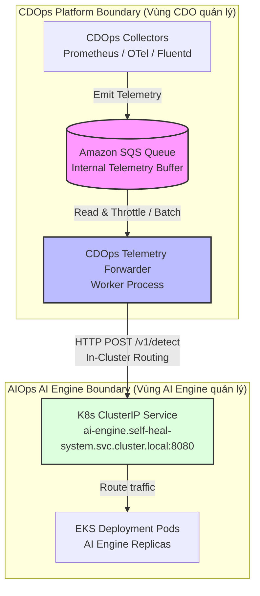

# Telemetry Contract - Generic Multi-Tenant Self-Heal Platform

## 1. Mục đích

Tài liệu này xác định **Hợp đồng Telemetry (Telemetry Specification)**. Hợp đồng định nghĩa cấu trúc, định dạng và quy chuẩn các tín hiệu giám sát (signals) mà bộ phận hạ tầng (Platform Infrastructure) có nhiệm vụ thu thập, chuẩn hóa từ cụm ứng dụng và truyền tải sang hệ thống trí tuệ nhân tạo (AI Engine) để phục vụ chẩn đoán lỗi tự động.

---

## 2. Quy tắc chung & Phân lập Tenant

* **Định danh Tenant (Tenant Scoping)**: Mọi điểm dữ liệu telemetry bắt buộc phải đính kèm định danh khách hàng (`tenant_id`) dưới dạng chuỗi UUID v4 để phục vụ cô lập dữ liệu.
* **Độ chính xác thời gian (Time Precision)**: Tất cả mốc thời gian (`ts`) bắt buộc phải tuân thủ định dạng RFC3339 UTC với độ chính xác đến mili-giây (ví dụ: `2026-06-25T10:30:00.123Z`).
* **Đóng gói dữ liệu (Payload Enrichment)**: Hệ thống tiền xử lý hạ tầng có trách nhiệm làm giàu (enrich) các siêu dữ liệu cấu trúc như Kubernetes namespace và deployment vào trường nhãn (`labels`) của telemetry trước khi truyền đi.

---

## 2.5. Quy định Xử lý Dữ liệu, Bảo vệ PII/Bí mật & Xử lý Malformed

### A. Nguyên tắc Bảo vệ PII và Scrubbing Bí mật (SOC2 Compliance)
Để tuân thủ nghiêm ngặt các tiêu chuẩn bảo mật và chứng nhận SOC2 Type II, dữ liệu telemetry tuyệt đối không được phép chứa bất kỳ thông tin nhận dạng cá nhân (PII - email, số điện thoại, token xác thực, credentials, connection string) nào.
1. **Trách nhiệm lọc dữ liệu**: CDO Platform chịu trách nhiệm chạy bộ lọc (scrubbing/redaction) ở lớp thu thập (Ingestion Layer) trước khi gửi telemetry sang AI Engine.
2. **Xử lý Stack Trace**: Đối với tín hiệu `application_log_event`, CDO bắt buộc phải áp dụng các bộ lọc regex để xóa bỏ hoặc ẩn danh các dữ liệu nhạy cảm như token, mật khẩu, và connection string xuất hiện trong stack trace.
3. **Mã hóa Định danh**: Các trường định danh như `pod_name` hay `container` phải sử dụng tên tài nguyên hệ thống chuẩn, cấm đính kèm tên riêng hay email của người dùng.

### B. Xử lý Dữ liệu không hợp lệ (Malformed Telemetry & Dead-Letter Queue)
Mọi điểm dữ liệu telemetry gửi sang AI Engine phải được xác thực thời gian thực (real-time validation) dựa trên Lược đồ JSON Schema chính thức ở Mục 3.
1. **Từ chối dữ liệu (Reject)**: Các payload lỗi cú pháp, thiếu trường bắt buộc, hoặc sai kiểu dữ liệu sẽ bị AI Engine từ chối tiếp nhận ngay lập tức với mã lỗi `400 Bad Request`.
2. **Cơ chế Dead-Letter Queue (DLQ)**: CDO Platform có trách nhiệm chuyển hướng (route) các bản ghi bị từ chối này vào một Dead-Letter Queue (DLQ) độc lập để phục vụ phân tích lỗi và giám sát chất lượng dữ liệu.
3. **Giám sát & Cảnh báo (Alerting)**: Hệ thống phải tự động kích hoạt cảnh báo nếu tỷ lệ malformed telemetry vượt quá `0.5%` tổng lưu lượng telemetry trong vòng 5 phút.

### C. Kênh Truyền tải Chính thức & Kiến trúc Bộ đệm Telemetry (Official Transmission Channel & Buffering Architecture)
1. **Giao thức Truyền tải Chính thức**: Kênh giao tiếp chính thức giữa CDOps Platform và AI Engine để truyền tải dữ liệu telemetry là **HTTP Push (HTTP POST)** trực tiếp đến API endpoint **`/v1/detect`** của AI Engine (được cấu hình tại địa chỉ nội bộ `http://ai-engine.self-heal-system.svc.cluster.local:8080/v1/detect`). AI Engine không trực tiếp pull hoặc poll dữ liệu từ hàng đợi tin nhắn của CDOps.
2. **Kiến trúc Bộ đệm Đầu cuối (SQS Buffering & Backpressure)**: Để đảm bảo tính sẵn sàng cao, chống mất mát dữ liệu khi có sự cố mạng hoặc quá tải hệ thống, CDOps Platform được khuyến nghị triển khai hàng đợi **Amazon SQS** làm bộ đệm dữ liệu nội bộ (Internal Telemetry Buffer) nằm hoàn toàn trong ranh giới hạ tầng của CDOps:
   * **Luồng đi của dữ liệu**: Các bộ thu thập của CDOps (Prometheus, OTel Collector, Fluentd) thu thập telemetry $\rightarrow$ Ghi nhanh vào hàng đợi SQS nội bộ của CDOps $\rightarrow$ Một tiến trình điều phối (CDOps Telemetry Forwarder/Worker) đọc dữ liệu từ SQS và thực hiện gửi (batch-push) sang cổng API `/v1/detect` của AI Engine qua HTTPS.
   * **Lợi ích**: Giúp CDOps chủ động kiểm soát tốc độ truyền tải (Backpressure) không vượt quá hạn mức Volume SLA (100 RPS per tenant), đồng thời lưu trữ tạm thời dữ liệu nếu AI Engine gặp sự cố.



---

## 3. Lược đồ Dữ liệu Telemetry (JSON Schema & Description)

Bảng dưới đây cung cấp tóm tắt trực quan về cấu trúc dữ liệu telemetry, theo sau là đặc tả lược đồ JSON Schema chính thức dùng cho kiểm thử và xác thực tự động.

### Bảng mô tả trường dữ liệu (Fields Description)

| Trường (Field) | Kiểu dữ liệu (Type) | Bắt buộc (Required) | Mô tả (Description) |
|---|---|---|---|
| `ts` | string (RFC3339) | ✓ | Mốc thời gian xảy ra sự kiện theo múi giờ UTC (độ chính xác mili-giây) |
| `tenant_id` | string (UUID v4) | ✓ | Chuỗi UUID v4 định danh duy nhất cho Tenant/Khách hàng |
| `service` | string | ✓ | Tên định danh của microservice phát sinh dữ liệu |
| `signal_name` | string (Enum) | ✓ | Tên tín hiệu thuộc danh mục các tín hiệu (phân thành các lớp: Ứng dụng & Dịch vụ, Hạ tầng & Container, Hàng đợi & Tài nguyên liên kết, Bảo mật & An toàn) được định nghĩa bên dưới |
| `value` | number / string | ✓ | Giá trị đo lường (đối với metric) hoặc nội dung văn bản log lỗi |
| `labels` | object | optional | Đối tượng chứa các nhãn bổ sung về topology cụm và định danh trace |
| `labels.system` | string | ✓ | Tên hoặc mã định danh của hệ thống phần mềm |
| `labels.namespace` | string | optional | Kubernetes namespace đang chạy tài nguyên (Tùy chọn) |
| `labels.deployment` | string | optional | Tên đối tượng Kubernetes Deployment quản lý dịch vụ (Tùy chọn) |
| `labels.pod_name` | string | optional | Tên pod cụ thể xảy ra sự cố (Tùy chọn) |
| `labels.container` | string | optional | Tên container cụ thể xảy ra sự cố (Tùy chọn) |
| `labels.endpoint` | string | optional | Tên API endpoint hoặc phương thức gRPC liên quan (Tùy chọn) |
| `labels.trace_id` | string | optional | Trace ID để liên kết chuỗi vết lỗi giao dịch (Tùy chọn) |
| `labels.span_id` | string | optional | Span ID của giao dịch cụ thể gặp sự cố (Tùy chọn) |
| `labels.operation` | string | optional | Tên giao dịch hoặc phương thức của trace span (Tùy chọn) |
| `labels.level` | string | optional | Mức độ nghiêm trọng của log ứng dụng (ERROR, WARNING, INFO) (Tùy chọn) |

### Lược đồ JSON Schema chính thức

```json
{
  "$schema": "http://json-schema.org/draft-07/schema#",
  "title": "TelemetryDataPoint",
  "description": "Lược đồ chuẩn hóa cho một điểm dữ liệu telemetry gửi sang AI Engine",
  "type": "object",
  "properties": {
    "ts": {
      "type": "string",
      "format": "date-time",
      "description": "Timestamp xảy ra sự kiện theo chuẩn RFC3339 UTC"
    },
    "tenant_id": {
      "type": "string",
      "format": "uuid",
      "description": "UUID v4 định danh duy nhất của Tenant/Khách hàng"
    },
    "service": {
      "type": "string",
      "description": "Tên định danh của microservice phát sinh dữ liệu"
    },
    "signal_name": {
      "type": "string",
      "enum": [
        "service_error_rate",
        "service_latency_p95",
        "container_resource_usage",
        "application_log_event",
        "distributed_trace_error_event",
        "pod_oom_event",
        "service_unhealthy",
        "queue_backlog",
        "service_throughput_rps",
        "container_restart_count",
        "secret_expiry_warning",
        "db_connection_pool_saturation"
      ],
      "description": "Tên tín hiệu được định nghĩa trong hợp đồng (được phân nhóm rõ ràng theo các tầng nghiệp vụ hệ thống)"
    },
    "value": {
      "type": [
        "number",
        "string"
      ],
      "description": "Giá trị đo lường (đối với metric) hoặc thông điệp lỗi (đối với log/event)"
    },
    "labels": {
      "type": "object",
      "properties": {
        "system": {
          "type": "string",
          "description": "Mã định danh hệ thống phần mềm"
        },
        "namespace": {
          "type": "string",
          "description": "Kubernetes namespace đang chạy tài nguyên (Tùy chọn)"
        },
        "deployment": {
          "type": "string",
          "description": "Tên đối tượng Kubernetes Deployment (Tùy chọn)"
        },
        "pod_name": {
          "type": "string",
          "description": "Tên pod phát sinh lỗi (đối với logs/resource metrics)"
        },
        "container": {
          "type": "string",
          "description": "Tên container phát sinh lỗi"
        },
        "endpoint": {
          "type": "string",
          "description": "Tên API endpoint hoặc phương thức gRPC"
        },
        "trace_id": {
          "type": "string",
          "description": "Mã định danh trace phục vụ liên kết vết lỗi"
        },
        "span_id": {
          "type": "string",
          "description": "Mã định danh span lỗi cụ thể"
        },
        "operation": {
          "type": "string",
          "description": "Tên giao dịch hoặc phương thức của trace span (Ví dụ: GET /checkout)"
        },
        "level": {
          "type": "string",
          "description": "Mức độ nghiêm trọng của log lỗi (ERROR, WARNING, INFO)"
        }
      },
      "required": [
        "system"
      ],
      "additionalProperties": true
    }
  },
  "required": [
    "ts",
    "tenant_id",
    "service",
    "signal_name",
    "value"
  ],
  "additionalProperties": false
}
```

---

## 4. Đặc tả các Tín hiệu Telemetry (Signals Specification)

Các tín hiệu telemetry được phân chia rõ ràng thành 4 lớp nghiệp vụ để phục vụ công tác giám sát, phân lập vùng ảnh hưởng (Blast Radius) và đưa ra quyết định tự chữa lành chính xác:

### A. Lớp Ứng dụng & Dịch vụ nghiệp vụ (Application & Service Layer)

Lớp này giám sát hiệu năng, lưu lượng và các lỗi phát sinh trực tiếp ở tầng mã nguồn ứng dụng và các điểm cuối API.

#### Tín hiệu 1: Tỷ lệ Lỗi Dịch vụ (`service_error_rate`)
* **Kiểu dữ liệu**: Gauge (Metric).
* **Mục đích**: Đo lường tỷ lệ các cuộc gọi dịch vụ bị lỗi (HTTP 5xx hoặc gRPC non-zero status) trên tổng số requests trong một cửa sổ trượt.
* **Giá trị**: Số thực từ `0.0` đến `1.0` (thể hiện phần trăm từ 0% đến 100%).
* **Payload mẫu**:
```json
{
  "ts": "2026-06-25T10:30:00.123Z",
  "tenant_id": "d3b07384-d113-495f-9f58-20d18d357d75",
  "service": "order-service",
  "signal_name": "service_error_rate",
  "value": 0.085,
  "labels": {
    "system": "E-COMMERCE",
    "endpoint": "/v1/orders/checkout",
    "namespace": "production",
    "deployment": "order-service"
  }
}
```

#### Tín hiệu 2: Độ trễ Phân vị 95 (`service_latency_p95`)
* **Kiểu dữ liệu**: Gauge (Metric).
* **Mục đích**: Đo lường độ trễ ở phân vị thứ 95 của các cuộc gọi API để phát hiện hiện tượng nghẽn hoặc treo dịch vụ.
* **Giá trị**: Số thực thể hiện thời gian phản hồi bằng mili-giây (milliseconds).
* **Payload mẫu**:
```json
{
  "ts": "2026-06-25T10:30:00.123Z",
  "tenant_id": "6c8b4b2b-4d45-4209-a1b4-4b532d56a31c",
  "service": "payment-gateway",
  "signal_name": "service_latency_p95",
  "value": 450.5,
  "labels": {
    "system": "E-COMMERCE",
    "endpoint": "/v1/charge",
    "namespace": "production",
    "deployment": "payment-gateway"
  }
}
```

#### Tín hiệu 3: Lưu lượng/Băng thông dịch vụ (`service_throughput_rps`)
* **Kiểu dữ liệu**: Gauge (Metric).
* **Mục đích**: Đo lường tổng số requests xử lý trên mỗi giây (throughput) để phát hiện sự thay đổi bất thường của tải hệ thống và đưa ra quyết định scale-up chính xác.
* **Giá trị**: Số thực biểu thị số lượng requests/giây (RPS).
* **Payload mẫu**:
```json
{
  "ts": "2026-06-25T10:30:00.123Z",
  "tenant_id": "d3b07384-d113-495f-9f58-20d18d357d75",
  "service": "order-service",
  "signal_name": "service_throughput_rps",
  "value": 145.8,
  "labels": {
    "system": "E-COMMERCE",
    "endpoint": "/v1/orders/checkout",
    "namespace": "production",
    "deployment": "order-service"
  }
}
```

#### Tín hiệu 4: Sự kiện Log lỗi ứng dụng (`application_log_event`)
* **Kiểu dữ liệu**: Event (Log).
* **Mục đích**: Ghi nhận các log có mức độ nghiêm trọng `ERROR` hoặc chứa nội dung Stack Trace để mô hình AI phân tích sâu nguyên nhân ở cấp độ dòng code.
* **Giá trị**: Chuỗi văn bản thô chứa nội dung log lỗi và stack trace.
* **Payload mẫu**:
```json
{
  "ts": "2026-06-25T10:30:05.456Z",
  "tenant_id": "d3b07384-d113-495f-9f58-20d18d357d75",
  "service": "order-service",
  "signal_name": "application_log_event",
  "value": "NullPointerException: Cannot invoke 'Database.connect()' because 'conn' is null\n\tat com.ecommerce.OrderService.saveOrder(OrderService.java:102)",
  "labels": {
    "system": "E-COMMERCE",
    "pod_name": "order-service-5f8d9b7c-xyz12",
    "level": "ERROR",
    "namespace": "production",
    "deployment": "order-service"
  }
}
```

#### Tín hiệu 5: Sự kiện lỗi giao dịch phân tán (`distributed_trace_error_event`)
* **Kiểu dữ liệu**: Event (Trace Span).
* **Mục đích**: Phát hiện các lỗi phát sinh trong chuỗi gọi dịch vụ liên kết (giao dịch phân tán) và xác định điểm đầu tiên phát sinh lỗi.
* **Giá trị**: Số nguyên thể hiện mã trạng thái lỗi của span giao dịch (ví dụ: HTTP Status Code hoặc gRPC Error Code).
* **Payload mẫu**:
```json
{
  "ts": "2026-06-25T10:30:04.999Z",
  "tenant_id": "6c8b4b2b-4d45-4209-a1b4-4b532d56a31c",
  "service": "frontend-web",
  "signal_name": "distributed_trace_error_event",
  "value": 503,
  "labels": {
    "system": "E-COMMERCE",
    "operation": "GET /v1/checkout",
    "trace_id": "d472bd0a6bda79d8d0b2852d8165cb97",
    "span_id": "cc3118e92762c87f",
    "namespace": "production",
    "deployment": "frontend-web"
  }
}
```

---

### B. Lớp Hạ tầng & Container (Infrastructure & Container Layer)

Lớp này giám sát sức khỏe, mức độ chiếm dụng tài nguyên phần cứng và các sự kiện vòng đời (lifecycle events) của container chạy trên cụm.

#### Tín hiệu 6: Bộ nhớ Container sử dụng thực tế (`container_resource_usage`)
* **Kiểu dữ liệu**: Gauge (Metric).
* **Mục đích**: Giám sát tài nguyên bộ nhớ làm việc thực tế (working set bytes) của container để phát hiện rò rỉ bộ nhớ (Memory Leak) hoặc nguy cơ bị OOMKilled.
* **Giá trị**: Số nguyên thể hiện dung lượng bộ nhớ sử dụng tính bằng Bytes.
* **Payload mẫu**:
```json
{
  "ts": "2026-06-25T10:30:00.000Z",
  "tenant_id": "6c8b4b2b-4d45-4209-a1b4-4b532d56a31c",
  "service": "inventory-service",
  "signal_name": "container_resource_usage",
  "value": 1073741824,
  "labels": {
    "system": "E-COMMERCE",
    "pod_name": "inventory-service-68d7f5c9b-abcde",
    "container": "main",
    "namespace": "production",
    "deployment": "inventory-service"
  }
}
```

#### Tín hiệu 7: Sự kiện Pod bị OOMKilled (`pod_oom_event`)
* **Kiểu dữ liệu**: Event (Alert).
* **Mục đích**: Báo hiệu ngay lập tức khi một container trong pod bị hệ điều hành tắt do vượt quá giới hạn bộ nhớ cấu hình (OOMKilled) để kích hoạt khẩn cấp runbook vá tài nguyên.
* **Giá trị**: Chuỗi mô tả sự kiện (ví dụ: `"OOMKilled: Pod order-service-5f8d9b7c-xyz12, Container main, Exit Code 137"`).
* **Payload mẫu**:
```json
{
  "ts": "2026-06-25T10:30:05.123Z",
  "tenant_id": "d3b07384-d113-495f-9f58-20d18d357d75",
  "service": "order-service",
  "signal_name": "pod_oom_event",
  "value": "OOMKilled: Pod order-service-5f8d9b7c-xyz12, Container main, Exit Code 137",
  "labels": {
    "system": "E-COMMERCE",
    "namespace": "production",
    "deployment": "order-service",
    "pod_name": "order-service-5f8d9b7c-xyz12",
    "container": "main"
  }
}
```

#### Tín hiệu 8: Số lần khởi động lại của container (`container_restart_count`)
* **Kiểu dữ liệu**: Counter (Metric).
* **Mục đích**: Giám sát tần suất và số lần khởi động lại tích lũy của container để phát hiện trạng thái CrashLoopBackOff (triển khai mã lỗi, lỗi cấu hình khởi động) nhằm kích hoạt tự động hoàn tác (`ROLLOUT_UNDO`).
* **Giá trị**: Số nguyên biểu thị số lần restart của container từ lúc khởi tạo.
* **Payload mẫu**:
```json
{
  "ts": "2026-06-25T10:30:10.000Z",
  "tenant_id": "6c8b4b2b-4d45-4209-a1b4-4b532d56a31c",
  "service": "inventory-service",
  "signal_name": "container_restart_count",
  "value": 5,
  "labels": {
    "system": "E-COMMERCE",
    "pod_name": "inventory-service-68d7f5c9b-abcde",
    "container": "main",
    "namespace": "production",
    "deployment": "inventory-service"
  }
}
```

#### Tín hiệu 9: Cảnh báo Dịch vụ Không Khỏe mạnh (`service_unhealthy`)
* **Kiểu dữ liệu**: Event (Alert).
* **Mục đích**: Báo hiệu khi một dịch vụ không vượt qua các đợt kiểm tra sức khỏe liên tiếp (Liveness/Readiness probe fail) từ Kubernetes Kubelet.
* **Giá trị**: Chuỗi mô tả trạng thái lỗi probe (ví dụ: `"Readiness probe failed: HTTP 500 Internal Server Error"`).
* **Payload mẫu**:
```json
{
  "ts": "2026-06-25T10:31:00.000Z",
  "tenant_id": "6c8b4b2b-4d45-4209-a1b4-4b532d56a31c",
  "service": "payment-gateway",
  "signal_name": "service_unhealthy",
  "value": "Readiness probe failed: HTTP 500 Internal Server Error",
  "labels": {
    "system": "E-COMMERCE",
    "namespace": "production",
    "deployment": "payment-gateway"
  }
}
```

---

### C. Lớp Hàng đợi & Tài nguyên liên kết (Middleware & Dependencies Layer)

Lớp này giám sát độ bão hòa của các thành phần trung gian (message brokers, cache) và các kết nối tới hệ quản trị cơ sở dữ liệu.

#### Tín hiệu 10: Hàng đợi Bị Nghẽn (`queue_backlog`)
* **Kiểu dữ liệu**: Gauge (Metric).
* **Mục đích**: Đo lường số lượng tin nhắn chưa được xử lý tồn đọng trong hàng đợi (message backlog) để phát hiện hiện tượng nghẽn cổ chai và đưa ra quyết định scale-up replicas cho worker.
* **Giá trị**: Số nguyên biểu thị số lượng tin nhắn đang tồn đọng trong hàng đợi.
* **Payload mẫu**:
```json
{
  "ts": "2026-06-25T10:32:00.000Z",
  "tenant_id": "d3b07384-d113-495f-9f58-20d18d357d75",
  "service": "notification-service",
  "signal_name": "queue_backlog",
  "value": 15000,
  "labels": {
    "system": "E-COMMERCE",
    "namespace": "production",
    "deployment": "notification-service"
  }
}
```

#### Tín hiệu 11: Độ bão hòa kết nối Database (`db_connection_pool_saturation`)
* **Kiểu dữ liệu**: Gauge (Metric).
* **Mục đích**: Đo lường tỷ lệ kết nối đang hoạt động trên tổng số kết nối tối đa của connection pool từ microservice đến Database, giúp phát hiện sớm nguy cơ cạn kiệt kết nối DB.
* **Giá trị**: Số thực từ `0.0` đến `1.0` (tương đương 0% đến 100% độ bão hòa pool).
* **Payload mẫu**:
```json
{
  "ts": "2026-06-25T10:30:15.000Z",
  "tenant_id": "d3b07384-d113-495f-9f58-20d18d357d75",
  "service": "order-service",
  "signal_name": "db_connection_pool_saturation",
  "value": 0.95,
  "labels": {
    "system": "E-COMMERCE",
    "namespace": "production",
    "deployment": "order-service"
  }
}
```

---

### D. Lớp Bảo mật & An toàn (Security & Compliance Layer)

Lớp này giám sát thời hạn hiệu lực của các thông tin bí mật (credentials, API keys) và chứng chỉ mật mã sử dụng trong hệ thống để tự động thực hiện xoay vòng khóa.

#### Tín hiệu 12: Cảnh báo hết hạn bí mật/chứng chỉ (`secret_expiry_warning`)
* **Kiểu dữ liệu**: Event (Alert).
* **Mục đích**: Phát hiện các chứng chỉ SSL/TLS hoặc API Secrets/Keys sắp hết hạn để kích hoạt tự động xoay vòng an toàn (`ROTATE_SECRET`) tránh gián đoạn dịch vụ nghiệp vụ.
* **Giá trị**: Số nguyên biểu thị số ngày còn lại trước khi hết hạn (ví dụ: `7` ngày).
* **Payload mẫu**:
```json
{
  "ts": "2026-06-25T10:30:20.000Z",
  "tenant_id": "6c8b4b2b-4d45-4209-a1b4-4b532d56a31c",
  "service": "payment-gateway",
  "signal_name": "secret_expiry_warning",
  "value": 7,
  "labels": {
    "system": "E-COMMERCE",
    "namespace": "production",
    "secret_name": "tf-3/payment-gateway/cert"
  }
}
```

---

## 5. Thuộc tính Vận hành & Cam kết Chất lượng Dữ liệu (Telemetry SLA)

Để phục vụ công tác định cỡ tài nguyên (capacity sizing), quản trị chi phí và bảo đảm tính cập nhật của dữ liệu cho mô hình AI, các tín hiệu telemetry phải tuân thủ các chỉ số vận hành sau:

| Lớp tín hiệu (Category) | Tên Tín hiệu (`signal_name`) | Tần suất gửi (Frequency) | Điểm phát (Emit Point) | Thời gian lưu trữ (Retention) | Cam kết độ trễ (Emit SLA) | Hạn mức Lưu lượng (Volume SLA) | Mục đích sử dụng (Used For) |
|---|---|---|---|---|---|---|---|
| **Application & Service** | `service_error_rate` | Cửa sổ trượt 1 phút | Ingestion Prometheus / OTel | Hot: 7 ngày <br> Cold: 90 ngày | < 10 giây từ lúc tính toán | Max: 100 events/sec per tenant | Phát hiện tăng tỷ lệ lỗi dịch vụ nghiệp vụ |
| **Application & Service** | `service_latency_p95` | Cửa sổ trượt 1 phút | Ingestion Prometheus / OTel | Hot: 7 ngày <br> Cold: 90 ngày | < 10 giây từ lúc tính toán | Max: 100 events/sec per tenant | Phát hiện nghẽn hoặc treo API |
| **Application & Service** | `service_throughput_rps` | Cửa sổ trượt 1 phút | Ingestion Prometheus / OTel | Hot: 7 ngày <br> Cold: 90 ngày | < 10 giây từ lúc tính toán | Max: 100 events/sec per tenant | Đo lường băng thông/tải hệ thống và ra quyết định scale |
| **Application & Service** | `application_log_event` | Theo thời gian thực (khi có lỗi) | OTel Log Collector / Fluentd | Hot: 14 ngày <br> Cold: 90 ngày | < 5 giây từ lúc log phát sinh | Max: 200 events/sec per tenant | Phân tích sâu nguyên nhân lỗi qua Stack Trace |
| **Application & Service** | `distributed_trace_error_event` | Theo thời gian thực (khi giao dịch lỗi) | OTel Trace Collector / Jaeger | Hot: 14 ngày <br> Cold: 90 ngày | < 5 giây từ lúc giao dịch hoàn tất | Max: 150 events/sec per tenant | Phác họa bản đồ lỗi giao dịch phân tán |
| **Infrastructure & Container** | `container_resource_usage` | Mỗi 15 giây | K8s Metrics Server / cAdvisor | Hot: 7 ngày <br> Cold: 90 ngày | < 15 giây từ lúc thu thập | Max: 50 events/sec per tenant | Phát hiện Memory Leak và nguy cơ OOMKilled |
| **Infrastructure & Container** | `pod_oom_event` | Theo thời gian thực (khi xảy ra OOM) | K8s Node / Container Lifecycle Event | Hot: 14 ngày <br> Cold: 90 ngày | < 5 giây từ lúc container bị terminate | Max: 10 events/sec per tenant | Phát hiện trực tiếp sự cố container bị OOMKilled |
| **Infrastructure & Container** | `container_restart_count` | Mỗi 15 giây | K8s Metrics Server / kube-state-metrics | Hot: 7 ngày <br> Cold: 90 ngày | < 15 giây từ lúc thu thập | Max: 30 events/sec per tenant | Phát hiện CrashLoopBackOff để thực hiện Rollout Undo |
| **Infrastructure & Container** | `service_unhealthy` | Theo thời gian thực (khi probe fail) | K8s Kubelet / Probe Monitor | Hot: 14 ngày <br> Cold: 90 ngày | < 5 giây từ lúc thay đổi trạng thái | Max: 10 events/sec per tenant | Phát hiện trạng thái không khỏe mạnh (Liveness/Readiness fail) |
| **Middleware & Dependencies** | `queue_backlog` | Mỗi 30 giây | Queue Metrics Collector (SQS/RabbitMQ) | Hot: 7 ngày <br> Cold: 90 ngày | < 10 giây từ lúc đo lường | Max: 50 events/sec per tenant | Phát hiện nghẽn hàng đợi để thực hiện scale up |
| **Middleware & Dependencies** | `db_connection_pool_saturation` | Mỗi 15 giây | Database Monitor / APM Agent | Hot: 7 ngày <br> Cold: 90 ngày | < 10 giây từ lúc đo lường | Max: 50 events/sec per tenant | Phát hiện cạn kiệt connection pool kết nối cơ sở dữ liệu |
| **Security & Compliance** | `secret_expiry_warning` | Mỗi 1 giờ (hoặc khi có cảnh báo) | Secrets Manager / Cert Manager Event | Hot: 7 ngày <br> Cold: 90 ngày | < 60 giây từ lúc kích hoạt | Max: 5 events/sec per tenant | Phát hiện hết hạn chứng chỉ/secret để xoay vòng khóa |

---

## 6. Chính sách Quản lý Phiên bản & Quy trình Thay đổi (Versioning & Change-Request)

Hợp đồng telemetry này được đóng băng ("FREEZE") để bảo đảm tính ổn định vận hành. Mọi thay đổi trong tương lai phải tuân thủ quy trình sau:

### A. Phân loại Thay đổi (Change Classification)
1. **Thay đổi lớn (Breaking Changes)**:
   * Định nghĩa: Xóa trường bắt buộc, thay đổi kiểu dữ liệu của trường hiện tại, thay đổi định dạng thời gian `ts`, hoặc thay đổi tên tín hiệu `signal_name` hiện có.
   * Quy trình: Bắt buộc nâng cấp phiên bản hợp đồng lên `/v2`. Hệ thống phải hỗ trợ song song cả hai phiên bản (Dual-support) tối thiểu **30 ngày** để các bên hoàn tất chuyển đổi.
2. **Thay đổi nhỏ (Non-breaking Changes)**:
   * Định nghĩa: Thêm trường tùy chọn (optional) trong `labels`, hoặc bổ sung giá trị enum mới không ảnh hưởng logic cũ.
   * Quy trình: Tăng số phiên bản phụ (minor bump), triển khai trực tiếp sau khi thông báo trước 5 ngày làm việc.

### B. Quy trình Thay đổi (Change-Request Process)
* Bước 1: Bên đề xuất gửi yêu cầu thay đổi hợp đồng (RFC - Request for Comments) bằng văn bản cho hội đồng kỹ thuật.
* Bước 2: Tổ chức họp đánh giá tác động với sự tham gia bắt buộc của AI Lead và các CDO Platform Leads.
* Bước 3: Sau khi thống nhất, cập nhật schema, chạy bộ test tự động và ký duyệt phiên bản hợp đồng mới.
