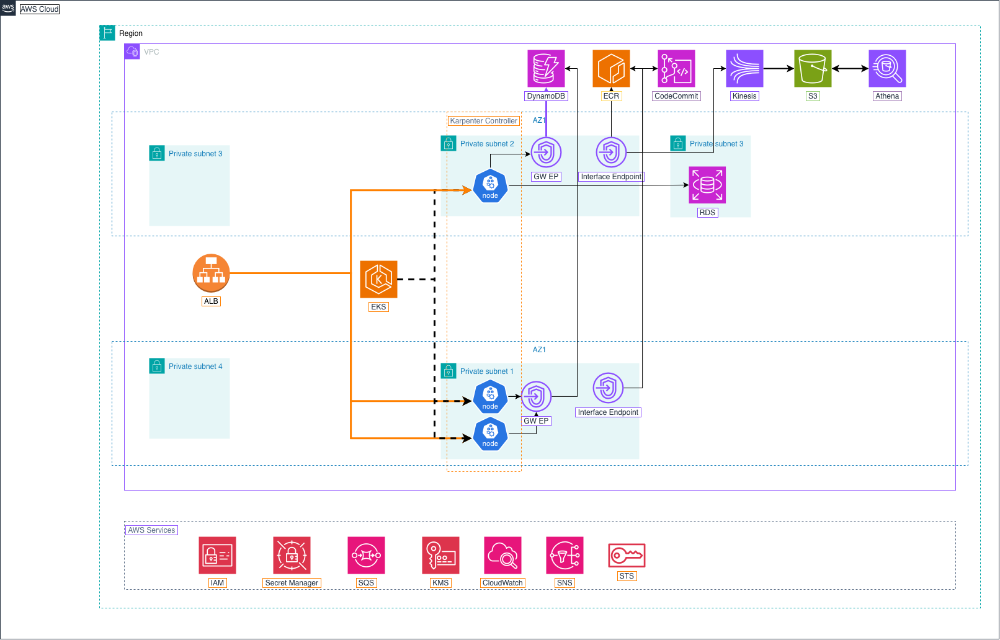

# Infrastructure Design - Task force 3 · CDO 1

<!-- Doc owner: CDO Team TF3
     Status: Draft (W11 T3-T4) → Final (W11 T6 Pack #1) → Updated (W12 T4 Pack #2)
     Word target: 1500-2500 từ
     Tier: Medium -->

## 1. Architecture diagram

*Caption: Cụm EKS node group, cơ sở dữ liệu RDS PostgreSQL, và Internal Application Load Balancer (ALB) chạy hoàn toàn trong các Private Subnets, không có public IP. Toàn bộ traffic đi tới các dịch vụ AWS (AWS Secrets Manager, Amazon S3, Amazon DynamoDB, AWS CodeCommit) đều được định tuyến thông qua các VPC Gateway và Interface Endpoints tương ứng, đảm bảo dữ liệu không đi ra Internet công cộng. Prometheus AlertManager chạy trong EKS gửi alerts trực tiếp tới Webhook Receiver qua ClusterIP nội bộ cụm (bypass ALB). AWS CloudWatch Alarms gửi alert đi qua Internal ALB để vào Webhook Receiver. Nhóm CDO-01 tự host AI Engine (build từ Docker image của nhóm AI) chạy trực tiếp trong cụm EKS (chung namespace `self-heal-system`), giúp Webhook Receiver và Direct Patch Engine giao tiếp API nội bộ tốc độ cao với độ trễ tối thiểu.*

---

## 2. Component table

| Component | AWS Service / Tool | Reason | Cost note |
|---|---|---|---|
| Compute (EKS Control Plane) | Amazon EKS v1.28 | K8s native để mô phỏng chính xác môi trường production của client (200+ microservices trên EKS). Hỗ trợ GitOps, IRSA, và K8s API patching native. | $73.00/month (fixed) |
| Node Autoscaling | Karpenter (không dùng Cluster Autoscaler) | Karpenter scale nhanh hơn 6-10x so với Cluster Autoscaler. Hỗ trợ Spot instance consolidation tối ưu chi phí sandbox. | ~$50.37/month (Spot `t3.medium` $0.023/hr x 3 nodes) |
| API Ingress | Internal Application Load Balancer (ALB) | Tiếp nhận HTTP alerts từ CloudWatch/EventBridge relay bên ngoài, hỗ trợ routing và authentication. | ~$22.27/month (Base + LCU) |
| Database (Sandbox - Optional) | RDS PostgreSQL Single-AZ (`db.t3.micro`) | Lưu cấu hình ứng dụng demo hoặc sandbox metadata (không bắt buộc cho state/locks). | ~$15.44/month |
| State Machine | DynamoDB (On-Demand) | Lưu trạng thái từng sự cố (Triggered -> Deciding -> Executing -> Verifying -> Done). TTL tự động giải phóng lock. | On-Demand, ~$2.00/month |
| Event Queue | Amazon SQS Standard Queue | Async buffer hàng đợi tin nhắn giữa Webhook Receiver và Worker Pods để xử lý alert storm. | ~$2.00/month |
| Audit Storage | Amazon S3 + Object Lock (COMPLIANCE mode) | Nguồn kiểm toán bất biến duy nhất cho SOC2. Compliance mode ngăn mọi xóa/sửa kể cả root account. | $0.23/month (10 GB) |
| Audit Streaming | Kinesis Firehose | Stream audit events từ Controller vào S3 ngay lập tức. Đảm bảo Raw Event + AI Decision + Pre/Post K8s State đều được lưu. | $0.29/month (10 GB) |
| Secrets Management | AWS Secrets Manager + ESO | Lưu credentials AI Engine, Git Deploy Key, DB creds. External Secrets Operator sync vào K8s Secret. | $2.40/month (6 secrets) |
| VPC Endpoints | PrivateLink Gateway / Interface | Kết nối an toàn nội bộ tới S3, DynamoDB, Secrets Manager và CodeCommit/SQS (Bedrock Endpoint là optional). | ~$29.30/month (2 AZs, minimal sandbox endpoints) |
| Observability | Prometheus + Grafana + CloudWatch | Prometheus thu thập K8s metrics, AlertManager kích hoạt self-heal. CloudWatch Logs thu thập log hệ thống AWS-level. | ~$8.00/month |
| Deployment Controller | **Argo Rollouts** | Custom Deployment Operator hỗ trợ cơ chế Canary và Blue-Green deployments nâng cao cho FastAPI Receiver. | Tích hợp Helm ($0/month) |

---

### **Tổng chi phí ước tính mỗi tháng (Rough Total Cost/Month)**

| Loại cấu hình | Tổng chi phí Sandbox / Tháng | Chi phí / Tenant / Tháng (Giả định 2 Tenants) |
|---|---|---|
| **Hạ tầng Sandbox (Total Sandbox)** | **$205.30** | **$102.65** |

* **Chi phí AI inference (biến đổi)**: Ước tính **$1.00 / tenant / tháng** (AWS Bedrock Claude 3 Haiku).
* **Tổng chi phí All-in dự báo**: **$103.65 / tenant / tháng** (bao gồm cả Hạ tầng cố định và AI inference).

**Các giả định đi kèm con số ước tính:**
* **Môi trường**: Sandbox chạy tại region `us-east-1`, hoạt động liên tục 730 giờ/tháng.
* **Quy mô thử nghiệm**: Gồm 2 tenants hoạt động song song trong cụm Sandbox.
* **Compute (EKS Nodes)**: Sử dụng 3 node EC2 Spot `t3.medium` chạy liên tục (đơn giá Spot `$0.023/node-hour`).
* **API Ingress**: Sử dụng 1 ALB hoạt động 24/7 (phát sinh trung bình 1 LCU).
* **Cơ sở dữ liệu**: Dùng RDS PostgreSQL Single-AZ (`db.t3.micro`) và DynamoDB On-Demand ở mức tải demo thấp.
* **Audit Storage & Streaming**: Phát sinh trung bình ~10 GB dữ liệu audit/tháng (lưu trữ trên S3, streaming qua Kinesis Firehose).
* **Quản lý Secrets**: Gồm 6 secrets trong AWS Secrets Manager.
* **Giám sát (Observability)**: Sử dụng Prometheus/Grafana tự vận hành trên EKS và CloudWatch logs ở mức low-volume.
* *Lưu ý*: Chi phí trên chưa bao gồm thuế, phí lưu trữ EBS volumes, NAT Gateway, KMS requests, chi phí biến đổi AI inference (Bedrock), data transfer và các gói support của AWS.

## 3. Differentiation angle deep-dive

### 3.1 Why this angle?

Nhóm chọn **GitOps Hybrid (Direct K8s API Patch + GitOps Commit)** để giải quyết 2 nhóm sự cố có yêu cầu khác nhau:
- **Fast Lane (Direct Patch):** Cho lỗi khẩn cấp (OOMKilled, Service Stuck). Vá nóng K8s API chỉ mất **~0.03 giây** (E2E sync hoàn tất trong ~14 giây, đạt SLO < 15s) rồi đồng bộ ngược cấu hình lên Git.
- **Slow Lane (GitOps Commit):** Cho lỗi thông thường (Queue Backlog scale). Commit cấu hình lên Git và ArgoCD tự động reconcile.

Để chống rủi ro ArgoCD tự revert patch nóng (race condition), nhóm áp dụng giải pháp **Sync Suspension**: tạm tắt sync policy của ArgoCD qua API $\rightarrow$ patch cluster $\rightarrow$ commit Git cấu hình limits mới $\rightarrow$ bật lại sync & force sync. Để triệt tiêu rủi ro Controller bị sập bất ngờ trong khi Auto-Sync đang bị tắt (gây lock leak), platform thiết lập cơ chế **Failsafe TTL / Auto-Recovery**: nếu trạng thái suspension vượt quá mốc timeout 5 phút mà chưa được resume, một cronjob phụ in-cluster sẽ tự động force-enable lại Auto-Sync cho ứng dụng của tenant để giữ trạng thái cluster luôn được reconcile.

### 3.2 Vượt trội ở đâu (số liệu)

**Competing angle:** AWS Serverless Orchestration (API Gateway + Step Functions + Lambda).

| Axis | My number (GitOps Hybrid) | Competing angle estimate (AWS Serverless) |
|---|---|---|
| **Cost / tenant / month** | **$102.65** | **$91.53** |
| **P99 latency to action** | **≤ 15,000 ms** | **≤ 20,000 ms** |
| **Ops overhead (hr/week)** | **2–3 hr/week** | **0.75–1.25 hr/week** |
| **Time to onboard tenant** | **180–240 min** | **240–360 min** |

*Giải trình:* Chi phí Hybrid ($102.65/tenant) cao hơn Serverless do EKS Control Plane và VPC Endpoints cố định, nhưng tối ưu compute dùng chung ở quy mô lớn. Latency của Hybrid thấp hơn do in-cluster API calls so với overhead cold start của Lambda/Step Functions.

### 3.3 Weakness chấp nhận

*   **Trade-off 1 (Chi phí cố định):** Chênh lệch $11.12/tenant/month (~12.1%) so với Serverless được chấp nhận để giữ mọi thành phần trong in-cluster security boundary. *Mitigation:* Nếu AlertManager nội bộ, có thể loại bỏ ALB để giảm tiếp $11.14/tenant.
*   **Trade-off 2 (Spot Interruption):** Karpenter dùng Spot nodes có nguy cơ bị thu hồi. *Mitigation:* Baseline platform services (ArgoCD, Webhook, Workflows controller) chạy trên On-Demand NodePool.

---

## 4. Multi-tenant approach

### 4.1 Tenant model

Trong hệ thống Self-Heal Platform, một tenant được định nghĩa là một khách hàng hoặc một đội ngũ sở hữu một nhóm microservice chạy trên Kubernetes. Sandbox hỗ trợ 2 tenants:

| Tenant Slug (nội bộ) | `tenant_id` (UUID v4 — gửi trong `X-Tenant-Id` cho AI Engine) | Namespace | Service Demo | Subscription Tier |
| :--- | :--- | :--- | :--- | :--- |
| `tnt-payment-demo` | `d3b07384-d113-495f-9f58-20d18d357d75` | `tenant-payment` | `payment-api` | **Pro** |
| `tnt-checkout-demo` | `6c8b4b2b-4d45-4209-a1b4-4b532d56a31c` | `tenant-checkout` | `checkout-api` | **Basic** |

*Lưu ý:* `tnt-*-demo` chỉ là slug hiển thị/đặt tên nội bộ (namespace, registry key). Theo AI API Contract (`ai-api-contract.md` mục 3.1), header `X-Tenant-Id` và field `tenant_id` bắt buộc đúng định dạng UUID v4 — registry DynamoDB lưu mapping `slug ↔ tenant_id (UUID)` để Receiver/Worker tra ra UUID đúng trước khi gọi AI Engine.

*   **Xác thực (Validate Context):** Mọi request alert bắt buộc mang header `X-Tenant-Id` (UUID v4). FastAPI Middleware áp dụng nguyên tắc Zero Trust: validate `tenant_id` với target namespace và registry trong DynamoDB. Nếu phát hiện mismatch (ví dụ: tenant-payment yêu cầu restart pod ở tenant-checkout namespace), request sẽ bị chặn lập tức và trả về `403 Forbidden` kèm ghi nhận log bảo mật `SECURITY_VIOLATION`.
*   **Tầng Dịch Vụ (Subscription Tiers):** Hỗ trợ Basic (quota thấp, cooldown dài), Pro (quota trung bình), và Enterprise (quota cao, custom policy linh hoạt).

### 4.2 Isolation pattern

Nhóm chọn mô hình **Bridge Isolation** làm kiến trúc cốt lõi:
- **Data isolation (Tách biệt dữ liệu):** Dùng chung DynamoDB, SQS, S3 để tối ưu chi phí hạ tầng sandbox, nhưng dữ liệu của mỗi tenant được phân vùng logic nghiêm ngặt bằng partition key (ví dụ: `PK = <tenant_id>#<incident_id>` trong DynamoDB) và prefix thư mục trong S3 (`s3://selfheal-audit/<tenant_id>/...`).
- **Compute/Execution isolation (Tách biệt quyền thực thi):** Cách ly logic compute bằng Namespace, K8s RBAC bindings (chỉ cho phép ServiceAccount `selfheal-executor` thao tác trong namespace được gán), và các ArgoCD AppProjects giới hạn target namespace.

### 4.3 Tenant onboarding flow

Quy trình onboarding tự động gồm 5 bước:
1.  **Bước 1 (Register):** Đăng ký thông tin tenant vào DynamoDB registry table `tenant_registry`.
2.  **Bước 2 (Namespace):** Terraform/GitOps Controller provision namespace cho tenant kèm label `tenant_id`.
3.  **Bước 3 (RBAC & Policy):** Tạo K8s Role, RoleBinding cục bộ tại namespace mới cho `selfheal-executor` và nạp policy vào registry.
4.  **Bước 4 (GitOps):** Tạo folder cấu hình riêng trong GitOps repo và khởi tạo ArgoCD `AppProject` & `Application` giới hạn target namespace.
5.  **Bước 5 (Smoke Test):** Gửi alert giả lập kiểm thử tính cô lập. Nếu pass hoàn toàn, chuyển trạng thái tenant sang `ACTIVE` (< 30 phút).

### 4.4 Noisy neighbor mitigation

Hệ thống triển khai 5 cơ chế phòng vệ độc lập để ngăn chặn hiện tượng một tenant spam alert làm nghẽn hệ thống:
1.  **Rate Limiting:** FastAPI Middleware sử dụng thuật toán DynamoDB Token Bucket giới hạn số alert/phút tùy theo tier (Basic: 10, Pro: 30, Enterprise: 60/phút).
2.  **Idempotency Lock & Cooldown:** DynamoDB Conditional Write khóa sự cố dựa trên key `tenant_id#namespace#service#alert_name#action_type`. Do DynamoDB TTL có độ trễ lớn (~48h), Webhook Receiver tự kiểm tra thời gian hết hạn cooldown bằng code logic (timestamp comparison) trước khi xử lý, đảm bảo giải phóng lock cooldown chính xác. Alert trùng lặp gửi đến trong thời gian cooldown sẽ bị bỏ qua và đánh dấu `SUPPRESSED_DUPLICATE`. *(Cooldown key này khác với `Idempotency-Key` UUID v4 bắt buộc theo AI API Contract — Worker vẫn phải sinh riêng một `Idempotency-Key` mới cho mỗi lần gọi cả 3 endpoint `/v1/detect`, `/v1/decide`, `/v1/verify`.)*
3.  **Concurrency Limit:** Giới hạn số lượng tiến trình vá lỗi đang chạy đồng thời (in-flight remediation) của mỗi tenant qua `asyncio.Semaphore` (Direct path) hoặc Argo Workflows semaphore (GitOps path).
4.  **ResourceQuota:** Cấu hình cứng CPU/Memory limits và Pod count ở mức namespace để ngăn chặn lỗi loop/scale vô tận ngốn tài nguyên node dùng chung.
5.  **Blast-radius Control:** Bộ lọc Policy Guardrail phân loại mức độ rủi ro của đề xuất action (ví dụ: scale tối đa ×2 replicas, cấm tác động `kube-system`).

---

## 5. Alternatives considered

### 5.1 Compute layer

* **Option A — EKS Fargate Profile:**
    * *Pros:* Mô hình Serverless hoàn toàn cho Kubernetes, loại bỏ hoàn toàn gánh nặng vận hành, vá lỗi hệ điều hành và quản lý hệ thống node EC2 phía dưới.
    * *Cons:* **Technical blocker thực sự**: Fargate không hỗ trợ triển khai `DaemonSet`, trong khi ADOT Collector/Prometheus Node Exporter bắt buộc chạy DaemonSet mức node.
* **Option B — EKS Managed Node Group + Cluster Autoscaler:**
    * *Pros:* Công nghệ mature, hỗ trợ DaemonSet native.
    * *Cons:* Tốc độ scale node chậm do phải chờ Auto Scaling Group (ASG) warm up.
* ✅ **Chosen:** Option C — EKS + Karpenter (Sử dụng Spot Instance EC2)
    * *Reason:* Khắc phục blocker của Fargate (Option A). Karpenter gọi trực tiếp EC2 API giúp scale node nhanh gấp 6-10x so với Cluster Autoscaler, đồng thời tự động consolidate node giúp giảm chi phí sandbox tối đa.

### 5.2 Database & Locks

* **Option A — Amazon ElastiCache Redis:**
    * *Pros:* Tốc độ phản hồi cực nhanh (< 1ms), hỗ trợ TTL key native.
    * *Cons:* Chi phí cố định cao do node chạy 24/7. Không scale kinh tế với 12TB dữ liệu.
* ✅ **Chosen:** Option B — DynamoDB On-Demand + Conditional Write
    * *Reason:* Cơ chế tính phí pay-per-request giúp tối ưu hóa chi phí sandbox về $0 khi idle. Conditional Write hỗ trợ làm idempotency lock store hoàn hảo, cùng tính năng tự động xóa dữ liệu cũ (TTL).

### 5.3 Webhook Receiver

* **Option A — AWS API Gateway + Lambda:**
    * *Pros:* Fully managed bởi AWS, tự động scale theo traffic, mô hình chi phí pay-per-use tối ưu.
    * *Cons:* Làm phức tạp hóa ranh giới bảo mật không cần thiết. Buộc phải thiết lập thêm một chuỗi kết nối phức tạp (`IAM ↔ K8s credential bridge`) để Lambda từ ngoài gọi ngược vào EKS API Server, làm mở rộng ranh giới bảo mật (Trust Boundary).
    * *Estimated Cost:* ~$0–10/tháng.
* **Option B — FastAPI Deployment trên EKS tích hợp Application Load Balancer (ALB):**
    * *Pros:* Nằm trọn vẹn trong cùng một Trust Boundary bảo mật với hệ thống tự chữa lành (namespace `self-heal-system`). Sử dụng trực tiếp ServiceAccount nội bộ cụm thông qua hàm `load_incluster_config()`, loại bỏ hoàn toàn việc expose IAM credential ra ngoài. ALB tiếp nhận tín hiệu HTTP alerts từ AlertManager, hỗ trợ routing theo path và tích hợp authentication bảo mật cao.
    * *Cons:* Phải tự quản lý manifest deployment và tốn chi phí cố định cho ALB.
    * *Estimated Cost:* ~$22.27/tháng (Phí cố định của ALB, phần code FastAPI chạy chung trên tài nguyên Node Group được Karpenter cấp phát).

✅ **Chosen:** Option B — FastAPI Deployment kết hợp AWS ALB
* **Reason:** Đơn giản hóa kiến trúc bảo mật, loại bỏ hoàn toàn cơ chế credential bridging phức tạp, tận dụng hạ tầng ALB để định tuyến alerts an toàn và chính xác.

### 5.4 Orchestrator (GitOps Path)

* **Option A — AWS Step Functions + Lambda:**
    * *Pros:* Trạng thái xử lý (state machine), cơ chế retry và timeout được build-in sẵn. Quản lý luồng trực quan trực tiếp trên AWS Console UI, chi phí pay-per-use lý tưởng.
    * *Cons:* Bộ điều phối nằm ngoài cluster, làm tăng độ phức tạp khi phân quyền chéo. Bản chất luồng GitOps xử lý lỗi Loại 2 không cần chạm trực tiếp vào EKS API mà đi qua Git repository, nên việc đưa state machine ra ngoài không mang lại lợi ích bảo mật nào thực tế.
    * *Estimated Cost:* ~$0–5/tháng.
* **Option B — Argo Workflows (Self-hosted trên K8s):**
    * *Pros:* Native Kubernetes CRD chạy ngay trong cụm, hỗ trợ xử lý luồng phức tạp dạng DAG và retry container mạnh mẽ. Giao diện UI hiển thị real-time đồng bộ trong hệ sinh thái K8s giúp demo trực quan hơn. Đội dự án đã de-risked rủi ro nhân sự khi có 01 thành viên chủ chốt có kinh nghiệm vận hành thực tế.
    * *Cons:* Phải quản lý các CRD nội bộ trong cụm K8s.
    * *Estimated Cost:* $0 thêm (Compute overhead chạy trực tiếp trên tài nguyên EC2 do Karpenter quản lý ở mục 5.1).

✅ **Chosen:** Option B — Argo Workflows
* **Reason:** Toàn bộ bộ não điều phối nằm trong cùng một Trust Boundary bảo mật với ArgoCD và Direct Patch Engine, giúp giảm độ phức tạp vận hành và tăng tính đồng bộ, thuyết phục khi demo thực tế.

### 5.5 Direct Patch Engine

* **Option A — AWS Lambda gọi vào EKS API:**
    * *Pros:* Tách biệt hoàn toàn khỏi lifecycle của cụm K8s, khả năng tự động scale-out độc lập khi gặp bão alert sự cố.
    * *Cons:* Tốn thêm network hop từ ngoài vào mạng nội bộ cụm EKS, cần cấu hình phân quyền IRSA phức tạp và làm tăng độ trễ (latency) xử lý hành động khẩn cấp.
    * *Estimated Cost:* ~$0–5/tháng.
* **Option B — Python kubernetes-client chạy In-Process:**
    * *Pros:* Thực hiện same-cluster API call (gọi trực tiếp trong cụm), mang lại latency thực thi cực thấp nhằm đáp ứng cam kết mốc thời gian phản hồi hành động chữa lành khẩn cấp dưới 15 giây. Triển khai cực kỳ đơn giản.
    * *Cons:* Gắn chặt vào lifecycle của Webhook Receiver pod, không thể bóc tách để scale độc lập cấu phần.
    * *Estimated Cost:* $0 thêm (Chạy chung pod với Webhook Receiver).

✅ **Chosen:** Option B — Python kubernetes-client
* **Reason:** Phục vụ tối thượng cho tốc độ phản hồi cực thấp để xử lý các sự cố khẩn cấp (như Pod bị OOMKilled hoặc Service stuck) ở quy mô môi trường sandbox.

### 5.6 Event Queue

* **Option A — SQS FIFO (First-In-First-Out):**
    * *Pros:* Đảm bảo thứ tự tin nhắn tuyệt đối (ordering guarantee) và hỗ trợ chống trùng lặp dữ liệu ở mức hạ tầng Cloud.
    * *Cons:* Throughput bị giới hạn nghiêm ngặt (300 - 3000 msg/s), không cần thiết khi hệ thống đã được thiết kế phòng vệ nhiều lớp ở tầng trên.
    * *Estimated Cost:* ~$0–2/tháng.
* **Option B — SQS Standard Queue:**
    * *Pros:* Thông số throughput gần như không giới hạn, chi phí tiệm cận mức $0, dễ dàng cấu hình bằng Terraform và đáp ứng hoàn hảo kịch bản bão alert (alert storm) của hệ thống SaaS gồm 200+ dịch vụ nhỏ.
    * *Cons:* Chấp nhận rủi ro nhỏ về at-least-once delivery (có thể phân phát lặp lại tin nhắn trong điều kiện mạng lỗi).
    * *Estimated Cost:* ~$0–2/tháng (nằm trong hạn mức 1 triệu request Free Tier của AWS).

✅ **Chosen:** Option B — SQS Standard
* **Reason:** Rủi ro trùng lặp hay sai thứ tự đã được xử lý triệt để bởi lớp ứng dụng nhờ sự kết hợp giữa `Idempotency-Key` và `DynamoDB conditional write`, do đó sử dụng SQS Standard là phương án tối ưu nhất về mặt kiến trúc phần cứng.

### 5.7 Audit Query & Streaming

* **Option A — OpenSearch Cluster / CloudWatch Logs Insights:**
    * *Pros:* Khả năng tìm kiếm text nâng cao mạnh mẽ, hỗ trợ dựng các hệ thống dashboard và analytics thời gian thực cho đội ngũ vận hành.
    * *Cons:* Chi phí duy trì cụm instance OpenSearch cực cao, tốn nhiều công sức vận hành hạ tầng nền và hoàn toàn vượt biên ngân sách $200 của sandbox. Không hỗ trợ native việc lưu trữ cô lập dữ liệu bất biến chống sửa xóa theo yêu cầu SOC2 bằng S3 Object Lock.
    * *Estimated Cost:* ~$30–100+/tháng.
* **Option B — Amazon Kinesis Data Firehose + S3 Object Lock + Amazon Athena:**
    * *Pros:* **Kinesis Firehose** thực hiện stream trực tiếp các audit events từ Controller vào S3 ngay lập tức. File log tĩnh được lưu trữ nghiêm ngặt tại S3 kết hợp cấu hình kích hoạt **S3 Object Lock (COMPLIANCE Mode)** khóa cứng dữ liệu, ngăn chặn mọi hành vi xóa/sửa kể cả với root account. **Amazon Athena** (Serverless SQL) cho phép dùng cú pháp SQL tiêu chuẩn để truy vấn log trực tiếp trên S3 theo mô hình pay-per-query siêu tiết kiệm chi phí.
    * *Cons:* Athena sẽ có độ trễ cao hơn OpenSearch với các tác vụ tìm kiếm tương tác thời gian thực liên tục.
    * *Estimated Cost:* ~$1–5/tháng cho toàn cụm Streaming + Query (Kinesis Firehose tính phí $0.029/GB, S3 tính phí $0.023/GB, Athena tính phí theo lượng data quét).

✅ **Chosen:** Option B — Kinesis Firehose + S3 Object Lock + Athena
* **Reason:** Tạo lập nguồn kiểm toán bất biến duy nhất (Single Source of Truth) phục vụ chứng chỉ bảo mật SOC2 của doanh nghiệp lớn với mức chi phí sandbox tối ưu, loại bỏ hoàn toàn gánh nặng phải tự vận hành cluster riêng.

### 5.8 Observability & Secrets Management

* **Option A — Toàn bộ Self-hosted Stack (Prometheus/Grafana trong cụm + K8s Static Secrets):**
    * *Pros:* Miễn phí hoàn toàn về mặt bản quyền service Cloud, tự do cấu hình metrics hệ thống.
    * *Cons:* Tốn rất nhiều công sức vận hành (ops effort) để duy trì tính sẵn sàng cao (HA) cho Prometheus và cấu hình lưu trữ PVC. Sử dụng static environment variables hoặc K8s Secrets thông thường để lưu credentials tạo ra lỗ hổng bảo mật nghiêm trọng, không đáp ứng tiêu chuẩn SaaS lớn.
    * *Estimated Cost:* ~$20–50/tháng cho phần compute + storage gán thêm.
* **Option B — Prometheus/Grafana (Metrics) + CloudWatch (AWS Services) + AWS Secrets Manager kết hợp External Secrets Operator (ESO):**
    * *Pros:* Giám sát đa lớp toàn diện: Prometheus thu thập K8s metrics, AlertManager kích hoạt self-heal; CloudWatch quản lý chỉ số ở mức AWS infra. Bảo mật thông tin nhạy cảm tuyệt đối bằng **AWS Secrets Manager**, dùng **ESO** để sync an toàn vào K8s Secret động, triệt tiêu hoàn toàn static env vars.
    * *Cons:* Phụ thuộc vào các dịch vụ tính phí của AWS.
    * *Estimated Cost:* ~$10.40/tháng (Prometheus/Grafana/CloudWatch logs tốn ~$8.00/tháng; AWS Secrets Manager tính phí cố định $2.40/tháng cho 6 secrets).

✅ **Chosen:** Option B — Prometheus/Grafana/CloudWatch + AWS Secrets Manager (với ESO)
* **Reason:** Giảm tối đa khối lượng vận hành hạ tầng trong thời gian ngắn ngủi 2 tuần, đồng thời kiên cố hóa lỗ hổng bảo mật về quản lý thông tin nhạy cảm theo đúng tiêu chuẩn vận hành Enterprise của client.

---

## 6. Scaling strategy

**Môi trường áp dụng**: EKS Managed Node Group + Karpenter (node provisioner) + HPA (Pod scaling). Instance type pool: `t3.medium`, `t3.large`, `t3.xlarge` (Karpenter tự chọn phù hợp nhất). Tối đa 5 Nodes tại bất kỳ thời điểm nào.

#### 1. Điều chỉnh cấu hình tài nguyên (Vertical Auto-Scaling)

**Khi nào cần tăng CPU/RAM cho 1 Pod (đơn vị chạy đơn lẻ):**

*   Pod **sử dụng RAM liên tục > 85% limit trong 3 phút** — dấu hiệu sắp OOMKilled.
*   Kubernetes Event ghi nhận `OOMKilled` cho bất kỳ Pod nào.
*   **Hành động (Remediation):** Self-Heal Engine nhận action `PATCH_MEMORY_LIMIT` từ AI Engine (`/v1/decide`), patch `memory_request_mb`/`memory_limit_mb` × 1.5 đúng theo params trong AI API Contract (action này không bao gồm CPU), commit manifest mới vào GitOps repo. ArgoCD tự động reconcile và rollout Pod mới.

**Khi nào cần máy chủ EKS Node lớn hơn (Karpenter Node Consolidation):**

*   Karpenter phát hiện Pod mới không thể schedule được do thiếu tài nguyên trên node `t3.medium` hiện tại.
*   **Hành động:** Karpenter tự động provision node mới lớn hơn (`t3.large` hoặc `t3.xlarge` từ instance pool EC2) trong vòng **< 60 giây**, migrate các Pods sang node mới và terminate node nhỏ cũ để tối ưu tài nguyên (Consolidation).

> [!NOTE]
> Với Karpenter, "vertical scaling node" được thực hiện tự động thông qua cơ chế **node consolidation**: Karpenter drain node nhỏ, reschedule Pod sang node lớn hơn mà không cần human approval.

#### 2. Tăng số lượng máy và Pods (Horizontal Auto-Scaling)

**Tăng/giảm Pod Replicas (HPA & Self-Heal Engine):**

*   **HPA cơ bản:** Tự động tăng/giảm replicas của Webhook Receiver (HPA trỏ vào Argo Rollouts custom resource `Rollout`) và Tenant Applications (HPA trỏ vào `Deployment`) dựa trên CPU metrics nội bộ cụm.
*   **Self-Heal Alert-driven Scaling (Cho SQS Queue Backlog):** HPA không can thiệp trực tiếp vào SQS depth. Thay vào đó, Prometheus watch metrics SQS qua CloudWatch exporter và AlertManager kích hoạt alert `QueueBacklog`. Webhook Receiver tiếp nhận alert, gọi AI Engine quyết định và kích hoạt action `SCALE_REPLICAS` (đúng enum trong AI API Contract, tăng replicas của worker deployment) qua luồng GitOps/Direct Patch.

| Chiều | Điều kiện kích hoạt | Thời gian duy trì | Action |
|---|---|---|---|
| **Scale-Up** | CPU trung bình **> 70%** hoặc Alert SQS Queue depth **> 1000 msgs** | 5 phút (CPU) / 2 phút (SQS) | HPA: +1 Pod replica (max 10 Pods) / Self-Heal: action `SCALE_REPLICAS` +2 replicas |
| **Scale-Down** | CPU trung bình **< 40%** hoặc Alert SQS Queue depth **< 100 msgs** | 10 phút liên tục (cooldown) | HPA: -1 Pod / Self-Heal: action `SCALE_REPLICAS` về baseline |

**Tăng/giảm Node (Karpenter):**

| Chiều | Điều kiện kích hoạt | Thời gian phản ứng | Action |
|---|---|---|---|
| **Scale-Up** | Bất kỳ Pod nào ở trạng thái `Pending` do thiếu CPU/RAM trên node hiện tại | **< 60 giây** | Provision EC2 Node mới, kích thước tự động chọn từ NodePool (max 5 Nodes) |
| **Scale-Down (consolidation)** | Node có utilization thấp, các Pod có thể reschedule sang node khác an toàn | Best-effort (< 5 phút) | Drain node, terminate instance, giải phóng chi phí |
| **Scale-Down (interruption)** | Spot instance bị AWS thu hồi (2 phút notice) | Ngay lập tức | Karpenter cordon + drain node trước khi bị thu hồi, reschedule Pod sang node khác |

#### 3. Ngưỡng kích hoạt cụ thể (tổng hợp)

| Chỉ số | Scale-Up Trigger | Scale-Down Trigger | Thời gian duy trì | Action |
|---|---|---|---|---|
| **CPU Pod** | `> 70%` | `< 40%` | 5 phút / 10 phút | HPA: ±1 Pod (Min 2, Max 10) |
| **RAM Pod** | `> 85% limit` | — | 3 phút | Self-Heal: Patch limits ×1.5, redeploy |
| **OOMKilled event** | Xuất hiện trong K8s Events | — | Ngay lập tức | Self-Heal: Patch limits ×1.5, redeploy |
| **Throughput (RPS)** | `> 150 RPS/Pod` | `< 50 RPS/Pod` | 3 phút | HPA: ±1 Pod |
| **SQS queue depth** | `> 1000 messages` | `< 100 messages` | 2 phút | Self-Heal: action `SCALE_REPLICAS` ±2 replicas |
| **Pod Pending** | Bất kỳ Pod `Pending` do resource | — | **< 60 giây** | Karpenter: Provision node mới (Max 5) |
| **Node consolidation** | — | Node có thể bin-pack sang node khác | Best-effort (< 5 phút) | Karpenter: Drain + terminate node |
| **Spot interruption** | AWS thu hồi Spot instance | — | Ngay lập tức (2 min notice) | Karpenter: Cordon, drain, reschedule |

## 7. Failure Modes & Recovery

Hệ thống thiết kế các phương án phòng vệ chủ động nhằm đảm bảo tính toàn vẹn dữ liệu đa thuê thuê (Multi-tenancy), duy trì chuỗi audit trail tuân thủ SOC2 và kiểm soát triệt để phạm vi ảnh hưởng (blast radius) khi có sự cố thảm họa xảy ra.

| Failure (Sự cố) | Detection (Cách phát hiện) | Recovery (Cơ chế khôi phục) | RTO | RPO |
| :--- | :--- | :--- | :--- | :--- |
| **FastAPI Receiver pod crash** | K8s liveness/readiness probe fail / Prometheus alert. | K8s tự động khởi động lại Pod nội bộ. Nhờ cơ chế lưu trữ tin nhắn không mất mát của **Amazon SQS**, các sự cố đang xếp hàng đợi sẽ không bị mất dữ liệu. | < 60s | 0 |
| **Karpenter Spot Node bị thu hồi** | AWS Spot Interruption Notice đẩy qua SQS. | Karpenter tự động kích hoạt quá trình `cordon` (ngăn cấp pod mới), `drain` (trục xuất pod cũ) và lập tức provision một EC2 node Spot mới để reschedule pod sang vùng an toàn trước thời hạn 2 phút của AWS. | < 120s (Không downtime) | 0 |
| **Git / ArgoCD API down (GitOps path)** | Webhook Receiver connection timeout / ArgoCD sync error log. | Các sự cố khẩn cấp (Urgent patterns như OOM, Service stuck) được định tuyến bypass để **Direct Patch Engine** can thiệp trực tiếp nội bộ cụm. Các sự cố thông thường (Deferred patterns như queue backlog) được giữ lại an toàn trong hàng đợi SQS để retry theo hàm mũ hoặc chuyển sang trạng thái `Escalated` báo cho SRE. | < 30s | 0 |
| **RDS PostgreSQL (Single-AZ) fail** | CloudWatch RDS event / DB TCP timeout / Engine alert. | AWS tự động reboot instance hoặc tái tạo instance mới, thực hiện mount lại ổ đĩa EBS Volume cũ (Môi trường Production target sẽ nâng cấp lên RDS Aurora Multi-AZ để failover tự động < 60s). | < 10 phút | < 5 phút (khôi phục từ daily snapshot và WAL logs) |
| **AZ Outage (Sập hoàn toàn 1 Availability Zone)** | CloudWatch cluster alarm / EKS Node unreachable alert. | Cấu hình các Deployments phân rã Multi-AZ tự động cân bằng tải. Karpenter nhận biết vùng lỗi, tự động loại bỏ AZ sập và kích hoạt provision thêm các EC2 Spot nodes mới tại các AZ còn lại đang hoạt động tốt ổn định. | < 5 phút | 0 |
| **DynamoDB State Machine / Lock Store nghẽn tải** | CloudWatch `ThrottledRequests` alarm / Conditional Write timeout. | Hệ thống tự động kích hoạt cơ chế phòng vệ **Circuit Breaker** (Cầu dao an toàn), tạm thời ngắt toàn bộ các hành động tự chữa lành tự động. Chuyển dịch toàn bộ luồng sự cố sang trạng thái `Escalated` bắn mã thông báo kèm Context Bundle về Slack để SRE can thiệp thủ công. | < 10s (Kích hoạt cầu dao) | 0 |
| **Kinesis Data Firehose / S3 Audit Layer bị ngắt** | CloudWatch `DeliveryToS3.Success` metric drop / Kinesis API error log. | Controller nhận tín hiệu lỗi stream ghi log audit trail. Tuân thủ nghiêm ngặt quy định SOC2, Controller lập tức **đóng băng mọi hành động can thiệp sửa lỗi** để tránh vi phạm quy định audit bất biến (Không tự ý sửa lỗi nếu hành động đó không thể được ghi vết kiểm toán an toàn). | < 15s (Tự động đóng băng) | 0 |
| **AWS Secrets Manager bị Access Denied / Lỗi đồng bộ** | External Secrets Operator (ESO) `SecretSynced` status = False. | Hệ thống giữ nguyên các K8s Secrets hiện tại được lưu cache nội bộ từ phiên đồng bộ gần nhất, đảm bảo Webhook Receiver và Engine không bị mất quyền truy cập Token AI hoặc Git Deploy Key đột ngột trong khi chờ kết nối lại. | < 5s (Bảo toàn cache) | 0 |
## Related documents

- [`03_security_design.md`](03_security_design.md)
- [`04_deployment_design.md`](04_deployment_design.md)
- [`05_cost_analysis.md`](05_cost_analysis.md)
- [`08_adrs.md`](08_adrs.md)
