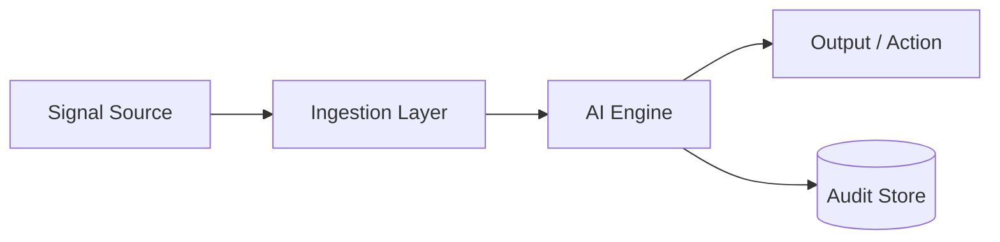

# Solution Design - <Đề tài>

<!-- Doc owner: <Nhóm AI>
     Status: Draft (W11 T3) → Updated (W11 T6 Pack #1) → Final (W12 T4 Pack #2)
     Word target: 1000-2000 từ -->

## 1. High-level architecture

<!-- Mermaid diagram preferred. Mọi diagram cần caption 2-3 dòng -->

*Diagram caption: <giải thích ngắn flow + tại sao cấu trúc này>*

## 2. Component breakdown

| Component | Responsibility | Tech choice | Why |
|---|---|---|---|
| Ingestion | Receive + normalize signals | <vd Kinesis / EventBridge> | <reason> |
| AI Engine | Detect + diagnose + decide | <Lambda / ECS / SageMaker> | <reason> |
| Audit | Persist decisions | <S3 + Athena / DynamoDB> | <reason> |
| Output | Notify / create artifact | <vd Slack / Jira API> | <reason> |

## 3. Data flow (step-by-step)

1. **Step 1**: Signal source emits → ...
2. **Step 2**: Ingestion normalizes → ...
3. **Step 3**: AI Engine consumes → ...
4. **Step 4**: Decision → Output / Audit
5. **Step 5**: Feedback loop (nếu có)

## 4. Alternatives considered (KEY)

<!-- Cho mỗi quyết định lớn, viết Option A/B + chọn cái nào + vì sao -->

### 4.1 <Decision area 1> (e.g., AI pattern: single-shot vs agent)

- **Option A**: ... Pros: ... Cons: ...
- **Option B**: ... Pros: ... Cons: ...
- ✅ **Chosen**: Option <A/B> - Reason: ...

### 4.2 <Decision area 2>

- **Option A**: ...
- **Option B**: ...
- ✅ **Chosen**: ...

## 5. Risk + mitigation

| Risk | Likelihood | Impact | Mitigation |
|---|---|---|---|
| AI hallucination on edge case | Medium | High | Confidence threshold + schema validation + refuse fallback |
| Bedrock throttling | Medium | Medium | Prompt cache + exponential backoff + rule-based fallback |
| Multi-tenant data leak | Low | High | Per-tenant context isolation + audit assertion |

## 6. Open design questions

- [ ] Q1: ... - *To resolve by T4 W11*
- [ ] Q2: ...

## Related documents

- [`03_ai_engine_spec.md`](03_ai_engine_spec.md) - AI engine architecture detail + governance + security
- [`../contracts/telemetry-contract.md`](../contracts/telemetry-contract.md) - signals CDO emit
- [`../contracts/ai-api-contract.md`](../contracts/ai-api-contract.md) - API CDO consume
- [`../contracts/deployment-contract.md`](../contracts/deployment-contract.md) - deployment topology
- [`05_adrs.md`](05_adrs.md) - architecture decision records
