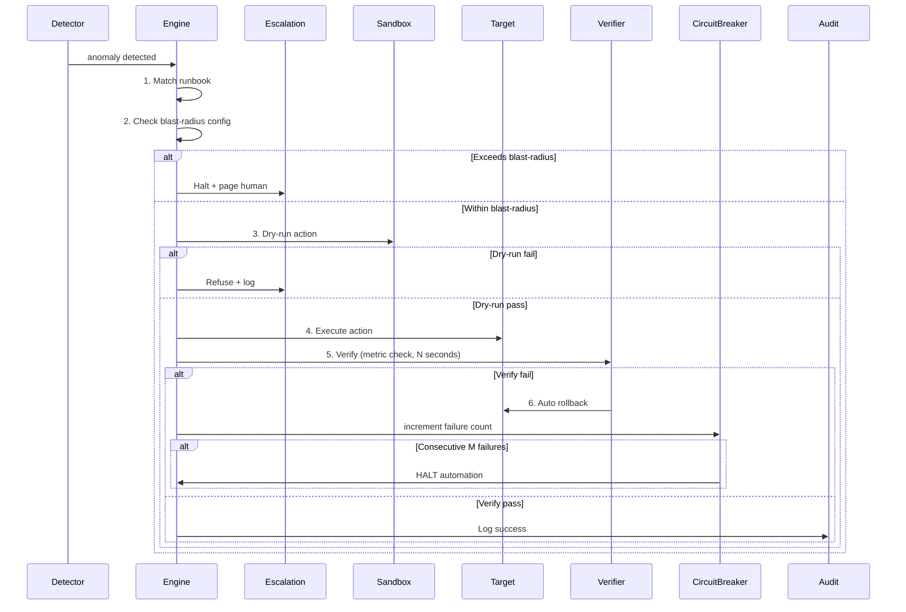
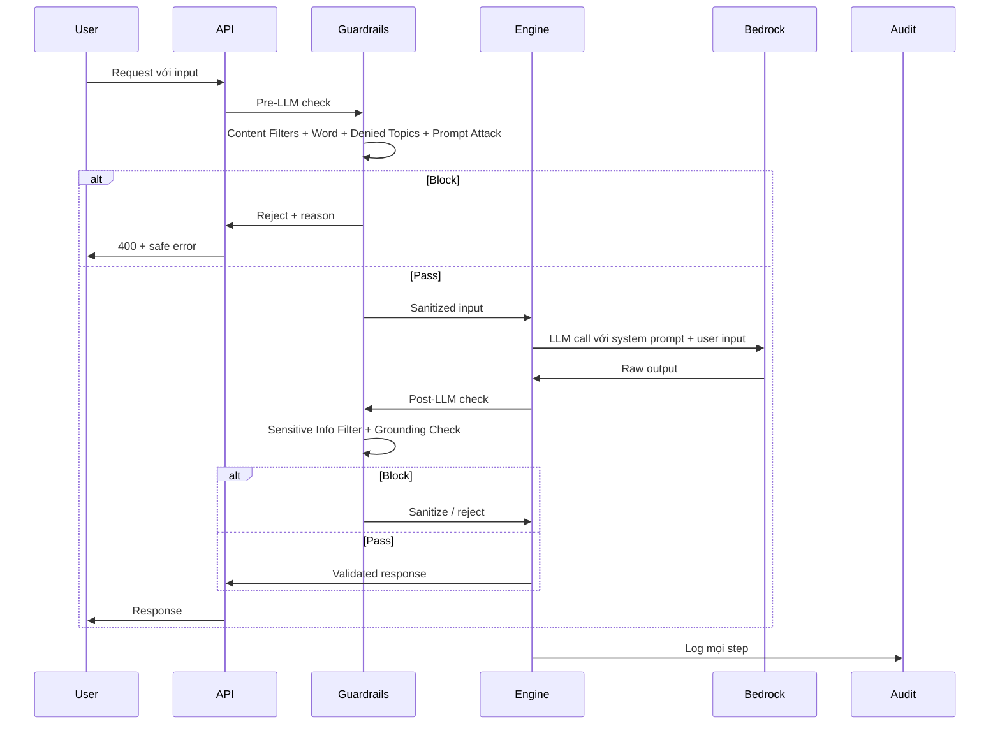

# AI Engine Spec - <Đề tài>

<!-- Doc owner: <Nhóm AI>
     Status: Draft (W11 T3-T4) → Final (W11 T6 Pack #1) → Updated (W12 T4 Pack #2)
     Word target: 2500-4000 từ (Heavy tier)
     Reference: TCB DAB Framework - AI Model Governance + AI Security (adapted for capstone) -->

> **📌 Capstone scope guide** - 9 sections không phải tất cả "must-deploy", một số "design-only":
>
> **Pack #1 (EOD T6 W11) minimum**: Sections 1, 2, 3, 4 (skeleton) + 5.1-5.3 + 6.1, 6.2.1, 6.2.2 (skeleton) + 7 (skeleton) + 8 (forecast) + 9
>
> **Pack #2 (EOD T4 W12) full**: TẤT CẢ sections refined với:
> - 5.5 Model NFR Control Matrix có MG-01..MG-08 evidence
> - 6 AI Security với Bedrock Guardrails configured (NOT just spec)
> - 7 Eval với real measured numbers
> - 8 Cost với actual measured
>
> **Design-only OK cho capstone** (note rõ trong doc nếu áp dụng): 6.6 LLM for AI Agents (nếu không dùng agentic) · 6.4 Training Model Security (capstone dùng foundation model)

## 1. Model architecture

<!-- Justify choice. Single-shot LLM / agentic multi-step / classifier ML / hybrid -->

- **Pattern chọn**: <e.g., single-shot LLM với structured output>
- **Lý do**: <why this fits đề tài + cost/latency trade-off>
- **Alternatives rejected**: <vd: agentic - bị reject vì latency 5x>

## 2. Model selection

| Field | Value |
|---|---|
| Provider | <Bedrock / OpenAI / Local> |
| Model ID | <vd `anthropic.claude-haiku-4-5-20251001`> |
| Region | <vd `ap-southeast-1`> |
| Context window | <vd 200k tokens> |
| Cost/1k input tokens | $X |
| Cost/1k output tokens | $X |
| Estimated per-call cost | $X |

## 3. Multi-tenant routing

<!-- Làm sao đảm bảo tenant A's data không leak sang tenant B? -->

- **Tenant identification**: `tenant_id` từ JWT / header X-Tenant-Id
- **Context isolation**: per-request scoping - không persist context across tenants
- **State storage**: per-tenant partition (DynamoDB pk = tenant_id, or RDS schema)
- **Audit log**: every AI call → audit entry với `tenant_id`

## 4. Prompt engineering / RAG strategy

### 4.1 System prompt

```
<Mô tả role, output format, safety rules>
```

### 4.2 User prompt template

```
<Mô tả input structure>
```

### 4.3 RAG (nếu áp dụng)

- **Index source**: ...
- **Embedding model**: ...
- **Retrieval top-k**: ...
- **Reranking**: ...

### 4.4 Prompt caching

- **Cache strategy**: <Bedrock prompt cache / manual / none>
- **Expected hit rate**: X%
- **Cost saving estimate**: ...

## 5. AI Model Governance

### 5.1 Governance Objectives

<!-- Tại sao cần governance? Risk model + AI ethics + business assurance -->

- Đảm bảo AI decision **explainable + auditable + reversible**
- Prevent **autonomous unsafe action** - mọi action có safety boundary
- **Compliance**: model behavior phù hợp policy + regulation
- **Reproducibility**: same input → same output (deterministic where possible) + audit trail

### 5.2 Scope (Capstone Year-1 equivalent)

- **In-scope**:
  - Single LLM provider (Bedrock) + 1-2 model versions
  - Assist-only decision (human-in-the-loop hoặc safety guardrail)
  - Multi-tenant với per-tenant context isolation
  - Eval methodology + drift detection
- **Out-of-scope** (defer to post-capstone):
  - Multi-provider failover
  - Fine-tuning own model
  - Autonomous action without safety gate
  - Cross-region model serving

### 5.3 Key Governance Principles

| Principle | Rationale | Enforcement |
|---|---|---|
| **Explainability** | Mọi decision có reasoning chain | Output schema includes `reasoning` field |
| **Auditability** | Trace decision input → output | Mandatory audit log với input_hash |
| **Confidence-gated action** | Low-confidence → escalate, không auto-act | Threshold trong code |
| **Reversibility** | Mọi action có rollback path | Dry-run mode + action queue |
| **Tenant isolation** | No cross-tenant context bleed | Per-request scoping + audit assertion |
| **Cost guard** | Spend không vượt quota | Per-tenant token quota + alarm |
| **Drift detection** | Model behavior drift detected sớm | Weekly eval re-run + compare baseline |

### 5.4 Enforcement Mechanisms (Architectural)

| Mechanism | Implementation | Layer |
|---|---|---|
| Input sanitization | Bedrock Guardrails Content Filter | Pre-LLM |
| Output schema validation | JSON schema enforce, reject if invalid | Post-LLM |
| Confidence threshold | App-level: confidence < 0.6 → `INVESTIGATE` | App layer |
| Audit log mandatory | Cannot return response without audit entry | App layer |
| Per-tenant quota | Token budget enforced trước call | App layer + DynamoDB counter |
| Rate limit | API Gateway usage plan per tenant | Edge |
| Circuit breaker | Bedrock throttle 60%+ → fallback rule-based | App layer |
| Eval baseline check | Weekly re-run eval set, alert nếu metric drop >10% | CI/CD job |

### 5.5 Model NFR Control Matrix

| NFR ID | Category | Requirement | Control | Evidence | Owner |
|---|---|---|---|---|---|
| MG-01 | Governance | Decision explainable | `reasoning` field ≤300 chars per output | Sample output | Nhóm AI |
| MG-02 | Governance | Audit complete | 100% AI calls audited | Audit log query | Nhóm AI |
| MG-03 | Governance | Confidence gating | Action requires confidence ≥ 0.6 | Code review + test | Nhóm AI |
| MG-04 | Performance | P99 latency < 500ms | Latency monitor | CloudWatch dashboard | Nhóm AI |
| MG-05 | Cost | Per-tenant token budget enforced | Quota check + DynamoDB counter | Quota config | Nhóm AI |
| MG-06 | Reliability | Bedrock fallback to rule-based on 60%+ throttle | Circuit breaker code | Chaos test | Nhóm AI |
| MG-07 | Compliance | No PII trong prompt | Pre-LLM sanitization | Audit log scan | Nhóm AI |
| MG-08 | Drift | Weekly eval baseline check | Scheduled eval job | CI/CD run history | Nhóm AI |
| MG-09 | Safety | Closed-loop verify post-action (only if engine takes action) | Verify metric check + auto rollback | Action audit log | Nhóm AI |
| MG-10 | Safety | Drift threshold + retrain trigger config (only if model self-trained) | Drift baseline + retrain ADR | Drift detection log | Nhóm AI |

### 5.6 Closed-loop Safety Pattern (chỉ áp dụng cho engine có ACTION - Self-Heal type)

<!-- Skip section này nếu engine chỉ ALERT/SUGGEST, không EXECUTE action.
     Self-Heal Engine + auto-containment engines BẮT BUỘC có section này. -->

Pattern bắt buộc cho mọi engine thực hiện action thật trên hệ thống (không phải chỉ suggest):



#### 5.6.1 Five sub-checkpoints (mọi action phải qua tất cả 5)

| # | Checkpoint | Spec | Capstone evidence |
|---|---|---|---|
| 1 | **Dry-run mode** | Mọi action có dry-run path; CI/CD test dry-run trước deploy | Test case dry-run + screenshot |
| 2 | **Blast-radius config** | Per-action limit: max % cluster · max N pod · max region · max $ cost impact | YAML config + ADR |
| 3 | **Verify post-act** | Metric check sau action: timeout N sec, threshold M | Verify rule code + test case |
| 4 | **Auto rollback** | Verify fail → automatic rollback to pre-action state; rollback also verified | Rollback code + chaos test |
| 5 | **Circuit breaker** | Consecutive K failures (vd 3) → halt automation, force manual escalation | Circuit breaker state machine + alert |

#### 5.6.2 Configuration example

```yaml
# action_safety_config.yaml
action: restart_pod_oom
dry_run:
  enabled: true
  mandatory_in_ci: true
blast_radius:
  max_pods_per_action: 3
  max_pods_per_namespace_per_hour: 10
  max_clusters_affected: 1
verify:
  enabled: true
  check_metric: container_memory_usage_bytes
  threshold: "< 80% of limit"
  timeout_seconds: 300
  sample_count: 3
rollback:
  enabled: true
  rollback_action: restore_pod_spec_from_snapshot
  rollback_verify: true
circuit_breaker:
  consecutive_failure_threshold: 3
  cool_down_seconds: 1800
  halt_action: page_oncall_critical
audit:
  log_all_steps: true
  retention_days: 90
```

#### 5.6.3 Test coverage requirement

Capstone: ≥3 chaos test scenarios chứng minh verify-fail → rollback hoạt động:
- Test 1: action thành công → verify pass → audit log đầy đủ
- Test 2: action chạy nhưng verify fail → rollback trigger → state restored
- Test 3: 3 consecutive failure → circuit breaker halt → manual escalation triggered

## 6. AI Security

### 6.1 AI Security Risks (Overview)

| Risk | Description | Severity | Mitigation Layer |
|---|---|---|---|
| **Prompt Injection** | Attacker injects malicious instructions via user input | High | Input sanitization + Guardrails |
| **Jailbreaking** | Bypass LLM guardrails / system prompt | High | System prompt isolation + Guardrails |
| **Data Leakage** | LLM reveals sensitive info trong response | High | Output filter + DLP scan |
| **Hallucination** | LLM generates inaccurate info | Medium | Grounding check + RAG + confidence threshold |
| **Denial of Service** | Complex prompts overload LLM | Medium | Length limit + rate limit + cost cap |
| **Model Extraction** | Probe queries extract model behavior | Low | Rate limit + audit anomaly detect |
| **Training Data Poisoning** | Malicious data trong training set | Low (using foundation model) | Use trusted provider; KB content moderation |

### 6.2 Prompt and LLM Output Validation

#### 6.2.1 Models Used

| Model Type | Model Name | Provider | Region | Deployment | Purpose |
|---|---|---|---|---|---|
| LLM | <vd Claude Sonnet 4.0> | Anthropic (via Bedrock) | ap-southeast-1 | Serverless | <Reasoning / RCA / NL generation> |
| Embedding (RAG) | <vd Cohere Embed v4> | Amazon Bedrock | ap-southeast-1 | Serverless | Vector embeddings cho retrieval (1024 dimensions) |

#### 6.2.2 Prompt Input Controls

| Control | Description |
|---|---|
| Input Sanitization | Remove special characters + injection patterns (e.g., "ignore previous instructions") |
| Prompt Template | Fixed template; user input fills placeholders only - never concat raw |
| Length Limiting | Limit input length (vd 4000 tokens) |
| Context Isolation | Clear delimiter giữa system context vs user context |
| Rate Limiting | Limit prompts per tenant per minute |
| Content Filtering | Filter inappropriate content trước khi send LLM |
| PII Stripping | Pre-LLM scan + redact PII before prompt construction |

#### 6.2.3 Output Validation Controls

| Control | Description |
|---|---|
| Schema validation | Strict JSON schema, reject invalid output |
| Confidence threshold | < 0.6 → `INVESTIGATE`, no auto-action |
| Grounding check | Bedrock Contextual Grounding - verify output bám source |
| Sensitive info filter | Bedrock Sensitive Info Filter - redact PII trong output |
| Length cap | Output length capped (vd 300 chars reasoning) |
| Refusal logic | LLM trả lời ambiguous → fallback path |

### 6.3 System Prompt Management

| Aspect | Standard |
|---|---|
| **Storage** | Version-controlled trong repo (`ai-engine/prompts/system_v<N>.md`) |
| **Access** | Read-only at runtime; updates qua PR + code review |
| **Versioning** | Semantic version + git tag |
| **A/B testing** | Shadow traffic cho new version trước promote |
| **Rollback** | Previous version always available, switch via config |
| **No secret leakage** | System prompt KHÔNG chứa API key / credential / PII |

### 6.4 Training / Model Source Security

<!-- Capstone scope: foundation model only, no fine-tune. Nhưng vẫn cần security around model source. -->

| Aspect | Control |
|---|---|
| Model provenance | Foundation model từ trusted provider (Bedrock managed) |
| Model version pinning | Specific model ID trong config - không "latest" auto-upgrade |
| Model update process | New version → re-run eval baseline → manual approve |
| Fine-tune (nếu có) | Out of capstone scope; nếu adopt, training data audited + dedicated KMS key |

### 6.5 Knowledge Base Security (RAG)

| Aspect | Control |
|---|---|
| KB content moderation | Pre-ingest review - no PII / no malicious instruction trong source |
| Per-tenant KB scoping | RAG index partition by tenant_id, query filter mandatory |
| Embedding access control | IAM scope to per-tenant prefix |
| Retrieval audit | Every retrieval logged: `query`, `top_k_doc_ids`, `tenant_id` |
| Poisoning detection | Anomaly detect on KB content changes (size, sentiment) |
| Source attribution | Output references source doc ID (cho user verify) |

### 6.6 LLM for AI Agents (nếu pattern agentic)

<!-- Skip section này nếu single-shot LLM, không phải agent -->

| Aspect | Control |
|---|---|
| Tool definition | Whitelist tools agent có thể call |
| Tool input validation | Mỗi tool input schema-validated |
| Tool output validation | Tool output schema-validated trước feed back vào LLM |
| Recursion limit | Max N reasoning steps trước force escalate |
| Action approval | Sensitive actions require human-in-the-loop hoặc dry-run mode |
| Audit per step | Every reasoning step logged separately |

### 6.7 AWS Bedrock Guardrails Configuration

<!-- Concrete config - đây là phần TCB enterprise rất rõ -->

| Guardrail Component | Configuration | Purpose |
|---|---|---|
| **Content Filters** | Hate, Insults, Sexual, Violence, Misconduct, Prompt Attacks - all set to HIGH | Block harmful content + prompt injection patterns |
| **Word Filters** | Custom denied word list + profanity built-in | Block specific banned terms |
| **Denied Topics** | <vd "financial advice", "legal opinion", "medical diagnosis"> | Topic-level refusal |
| **Sensitive Information Filters** | PII types: EMAIL, PHONE, NAME, ADDRESS - action: ANONYMIZE | Redact PII trong input/output |
| **Contextual Grounding Check** | Threshold: 0.7 (grounding) + 0.7 (relevance) | Verify output bám source |
| **Word policy** | Profanity filter ON | Layer 1 filter |

#### AI Agent Security Flow



### 6.8 AI-specific Audit Trail

```json
{
  "ts": "2026-06-25T10:30:00Z",
  "correlation_id": "uuid",
  "tenant_id": "tnt-abc",
  "ai_call": {
    "model_id": "claude-haiku-4-5",
    "prompt_template_version": "v1.2",
    "input_tokens": 250,
    "output_tokens": 120,
    "input_hash": "sha256:...",
    "output_hash": "sha256:...",
    "guardrail_actions": ["sanitized_pii", "grounding_pass"],
    "confidence": 0.82,
    "decision": "SCALE_UP",
    "latency_ms": 420,
    "cost_usd": 0.0023
  }
}
```

## 7. Eval methodology

- **Test set composition**: synthetic <N> + real-anonymized <M> = total ≥10 scenarios
- **Metrics tracked**:
  - Precision (true positive / predicted positive)
  - Recall (true positive / actual positive)
  - F1
  - P50 / P99 latency
  - Cost per correct decision
- **Acceptance threshold**:
  - Precision ≥ 0.8
  - Recall ≥ 0.7
  - P99 latency < Xms
- **Eval set location**: `<repo>/ai-engine/eval/` (JSON)

## 8. Cost model

| Item | Per call | Per day (forecast) | Per tenant/month |
|---|---|---|---|
| LLM input tokens | $X | $X | $X |
| LLM output tokens | $X | $X | $X |
| Embedding (RAG) | $X | $X | $X |
| Storage (audit) | - | - | $X |
| **Total** | | | **$N** |

## 9. Deployment topology

- **Compute**: <ECS Fargate / Lambda / SageMaker endpoint>
- **Replica strategy**: min 2, max 10, autoscale by CPU/queue
- **Cold start mitigation**: <vd provisioned concurrency>
- **Region**: <region + multi-AZ>
- **Network**: private subnet, internal ALB
- **Secrets**: Secrets Manager (Bedrock IAM, không API key)

## Related documents

- [`02_solution_design.md`](02_solution_design.md) - high-level architecture context
- [`04_eval_report.md`](04_eval_report.md) - eval methodology + results feeding NFR MG-04, MG-08
- [`05_adrs.md`](05_adrs.md) - ADRs for model/governance decisions
- [`../contracts/ai-api-contract.md`](../contracts/ai-api-contract.md) - API exposed to CDO
- [`../../cdo/docs/03_security_design.md`](../../cdo/docs/03_security_design.md) - platform-level security (AI security details ở §6 doc này)
- [`../../cdo/docs/05_cost_analysis.md`](../../cdo/docs/05_cost_analysis.md) - total cost includes AI inference từ §8 doc này
