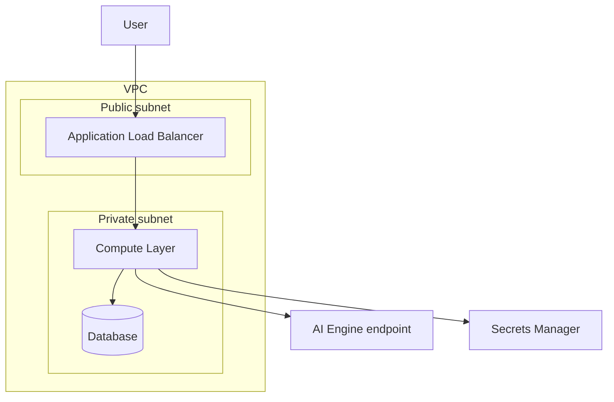

# Infrastructure Design - Task force <N> · CDO <M>

<!-- Doc owner: <Nhóm CDO>
     Status: Draft (W11 T3-T4) → Final (W11 T6 Pack #1) → Updated (W12 T4 Pack #2)
     Word target: 1500-2500 từ -->

## 1. Architecture diagram



*Caption: <giải thích flow + tại sao layout này>*

## 2. Component table

| Component | AWS Service | Reason | Cost note |
|---|---|---|---|
| Compute | <Lambda / Fargate / EKS> | <why> | $X |
| API entry | <API GW / ALB> | <why> | $X |
| Database | <DynamoDB / RDS / Aurora> | <why> | $X |
| Storage | <S3 + tier> | <why> | $X |
| Event bus | <EventBridge / Kinesis / SQS> | <why> | $X |
| Observability | <CloudWatch / Grafana> | <why> | $X |

## 3. Differentiation angle deep-dive

### 3.1 Why this angle?

<!-- Tại sao chọn serverless-first / K8s-heavy / managed-services / hybrid? -->

### 3.2 Vượt trội ở đâu (số liệu)

| Axis | My number | Competing angle estimate |
|---|---|---|
| Cost / tenant / month | $X | $Y |
| P99 latency | Xms | Yms |
| Ops overhead (hr/week) | X | Y |
| Time to onboard tenant | X min | Y min |

### 3.3 Weakness chấp nhận

<!-- Honest về trade-off. Reviewer thích honesty hơn là "everything is great" -->

## 4. Multi-tenant approach

### 4.1 Tenant model

- **Tenant ID format**: UUID v4
- **Header**: `X-Tenant-Id` mandatory all API calls
- **Subscription tiers**: basic / pro / enterprise (impact: quota, feature flags)

### 4.2 Isolation pattern

- **Data isolation**: <silo (per-tenant DB) / pool (shared with row-level) / bridge (hybrid)> - justify
- **Compute isolation**: <shared / per-tenant container / per-tenant account>
- **Why this pattern**: <cost vs isolation strength trade-off>

### 4.3 Tenant onboarding flow

```
1. POST /platform/v1/tenants (tenant_name, contact, tier)
2. IaC trigger (Terraform module or Step Function)
3. Provision: IAM role + namespace + DB schema + initial config
4. Smoke test
5. Webhook callback: tenant ready (< 30 min total)
```

### 4.4 Noisy neighbor mitigation

- **Per-tenant quota**: <vd 1000 req/min / tenant>
- **Rate limiting**: API Gateway usage plan / custom Lambda
- **Resource reservation**: <vd dedicated Fargate task for enterprise tier>

## 5. Alternatives considered

### 5.1 Compute layer

- **Option A**: Lambda + API GW - Pros: cost-tight, ops-light · Cons: cold start, 15min limit
- **Option B**: ECS Fargate + ALB - Pros: longer runtime, predictable latency · Cons: higher fixed cost
- ✅ **Chosen**: ... - Reason: ...

### 5.2 Database

- **Option A**: ... 
- **Option B**: ...
- ✅ **Chosen**: ...

## 6. Scaling strategy

- **Vertical**: <CPU/memory bump triggers>
- **Horizontal**: <auto-scaling rules>
- **Triggers**: target CPU 70% / request count / queue depth

## 7. Failure modes + recovery

| Failure | Detection | Recovery | RTO | RPO |
|---|---|---|---|---|
| Single task crash | ECS health check | Auto-restart | < 60s | 0 |
| AZ outage | CloudWatch alarm | Multi-AZ failover | < 5min | < 1min |
| DB primary fail | RDS event | Read replica promotion | < 5min | < 1min |
| Region outage | External monitor | Manual region switch (post-capstone) | TBD | TBD |

## Related documents

- [`03_security_design.md`](03_security_design.md) - Network Security §4 + IAM §5 + Data Security §6 expand on infra concerns
- [`04_deployment_design.md`](04_deployment_design.md) - IaC + CI/CD + GitOps cho infra này
- [`05_cost_analysis.md`](05_cost_analysis.md) - Per-tenant cost model based on this infra
- [`08_adrs.md`](08_adrs.md) - Infra architecture decisions
