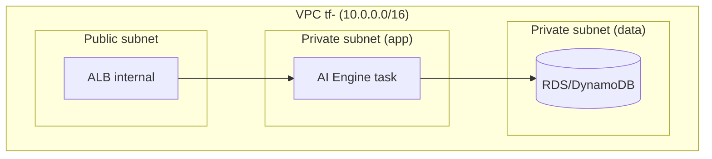

# Security Design - Task force <N> · CDO <M>

<!-- Doc owner: <Nhóm CDO>
     Status: Draft (W11 T4) → Final (W11 T6) → Refined (W12 T4)
     Word target: 1200-2000 từ
     Scope: DevOps-level security (network, IAM, secrets, encryption, audit, K8s if applicable).
     Out of scope: app-level authN/authZ deep, threat modeling STRIDE, SIEM integration, Security Control Matrix - là phần SDE/SecOps, không trong scope DevOps capstone. -->

> **📌 Capstone scope guide**: file này focus vào những gì DevOps thực sự cấu hình + deploy. Không phải security audit document đầy đủ enterprise.
>
> **W11 EOD T6 minimum**: §1 + §2 + §3 + §4 + §7 (skeleton) + §8 (open questions)
> **W12 EOD T4 final**: tất cả section refined với evidence (config files, IAM policy snippets, KMS key ARN, audit log sample)

---

## 1. Network Security

### 1.1 Network Diagram

<!-- Mermaid diagram thể hiện VPC layout, subnet, SG, ALB, NAT, internet gateway. -->

### 1.2 Security Groups

| SG name | Inbound | Outbound | Attached to |
|---|---|---|---|
| `tf-<N>-alb-sg` | 443 từ CDO platforms trong task force | 8080 to app-sg | ALB |
| `tf-<N>-app-sg` | 8080 từ alb-sg | 5432 to db-sg, 443 to Bedrock/Secrets Manager | ECS/Lambda task |
| `tf-<N>-db-sg` | 5432 từ app-sg | (none) | RDS/DocDB |

### 1.3 Network ACL / VPC Endpoint

<!-- Liệt kê VPC endpoint (Bedrock, Secrets Manager, S3) nếu có. Mục đích: traffic không ra Internet, chạy private. -->

- VPC endpoint cho Bedrock runtime: <ARN>
- VPC endpoint cho Secrets Manager: <ARN>
- VPC endpoint cho S3 (audit storage): <ARN>

---

## 2. IAM & Access Control

### 2.1 Service Roles

| Role | Used by | Permissions (least-privilege) |
|---|---|---|
| `tf-<N>-ai-engine-task-role` | ECS task / Lambda | `bedrock:InvokeModel`, `secretsmanager:GetSecretValue` (specific ARN), `s3:PutObject` (audit bucket only) |
| `tf-<N>-platform-deploy-role` | CI/CD pipeline | ECS deploy, ECR push, CloudFormation deploy. KHÔNG có `iam:*`, `s3:Delete*` |
| `tf-<N>-readonly-role` | Mentor review / debug | CloudWatch logs read, ECS describe, S3 GetObject |

### 2.2 K8s RBAC (nếu CDO chọn EKS angle)

| Role | Subject | Verbs | Resources |
|---|---|---|---|
| `developer` | dev group | get/list/watch | pods, services, configmaps |
| `sre` | sre group | * | * trong namespace `app` (không `kube-system`) |
| `viewer` | external auditor | get/list | tất cả (read-only) |

### 2.3 Cross-account Access

<!-- Nếu task force account khác với platform account, ghi rõ assume role pattern. -->

---

## 3. Secrets Management

### 3.1 Secrets Inventory

| Secret | Storage | Rotation | Accessed by |
|---|---|---|---|
| `BEDROCK_API_KEY` | Secrets Manager `tf-<N>/ai-engine/bedrock` | manual (no rotation) | ai-engine task role |
| `DB_CREDENTIALS` | Secrets Manager `tf-<N>/platform/db` | 30 days auto | app-sg |
| `WEBHOOK_SIGNING_KEY` | Secrets Manager `tf-<N>/platform/webhook` | manual | alert ingestor |

### 3.2 Inject Pattern

<!-- ECS task definition? Kubernetes External Secrets Operator? Env var via Init container? -->

- ECS: secret reference trong task definition `valueFrom: arn:...`
- K8s: External Secrets Operator → K8s Secret → env var

### 3.3 Anti-leak Controls

- Secrets KHÔNG commit Git (gitleaks scan trong CI).
- Container image không bake credential (Dockerfile review).
- Application log redact pattern (regex `Bearer.*` → `[REDACTED]`).

---

## 4. Encryption

### 4.1 At Rest

| Data | Storage | KMS key | Notes |
|---|---|---|---|
| Audit log | S3 bucket `tf-<N>-audit` | `tf-<N>-audit-cmk` (CMK) | Object Lock 90 ngày |
| Application data | RDS/DynamoDB | AWS-managed `aws/rds`, `aws/dynamodb` | Encryption tại table level |
| EBS volume | ECS host | AWS-managed | Default encryption ON |

### 4.2 In Transit

- ALB listener: TLS 1.2+ only (cipher policy `ELBSecurityPolicy-TLS13-1-2-2021-06`).
- Internal service-to-service: TLS via service mesh hoặc bearer token over HTTPS (mTLS = Phase 2).
- Bedrock invocation: HTTPS via VPC endpoint.

### 4.3 Key Management

- CMK rotation: enabled, 1 year cadence.
- Key policy: only allow `tf-<N>-*-role` access, deny everyone else.
- KMS audit: CloudTrail data event ON cho audit CMK.

---

## 5. Audit Logging

### 5.1 What to Log

- **AI engine decision**: every `/v1/*` call, fields: timestamp, tenant_id, correlation_id, input hash, output, confidence, model version, latency.
- **Infrastructure change**: CloudTrail management events (Terraform apply, ECS service update).
- **K8s API**: audit log enabled (advanced) hoặc audit-policy basic (only mutations).
- **Application error**: structured log với correlation_id để trace cross-service.

### 5.2 Storage + Retention

| Log type | Storage | Retention | Query interface |
|---|---|---|---|
| AI decision audit | S3 Object Lock + Athena | 90 ngày hot, 1 năm cold | Athena SQL |
| CloudTrail | S3 + CloudTrail Lake | 90 ngày | CloudTrail console |
| Application log | CloudWatch Logs | 14 ngày | Logs Insights |
| K8s audit | CloudWatch Logs hoặc S3 | 30 ngày | Logs Insights |

### 5.3 PII Handling (basic)

- Schema whitelist: chỉ accept field đã defined trong telemetry contract.
- Redaction at ingest: regex pattern cho email, phone, credit card → `[REDACTED]`.
- 1 unit test demo redaction working là đủ cho capstone.

---

## 6. Container & K8s Security (chỉ áp dụng nếu CDO chọn K8s angle)

- Image scan: Trivy trong CI, fail-on HIGH/CRITICAL CVE.
- Image signing: Cosign sign trong CI, admission webhook verify (Phase 2 nếu chưa kịp).
- Pod Security Standard: `restricted` profile cho namespace `app`.
- NetworkPolicy: deny-all default + explicit allow per service.
- IRSA cho service account thay vì static AWS credential trong pod.

---

## 7. Compliance Touchpoints

<!-- Ngắn gọn. Capstone không phải compliance audit. -->

| Standard | Relevant controls (capstone scope) |
|---|---|
| SOC2 Type II | CC6.1 (logical access via IAM), CC7.2 (system monitoring via CloudWatch), CC8.1 (change management via Git + CI/CD) |
| GDPR | Article 32 (security of processing): encryption at rest + in transit, access control |
| PCI-DSS | Out of scope cho capstone (no card data) |

Document mapping ở level "control → AWS service được dùng" là đủ. Không cần evidence per-control như audit thật.

---

## 8. Open Questions

<!-- Câu hỏi security thực sự ambiguous - phải decide nhưng chưa đủ data. -->

- <Q1: ...>
- <Q2: ...>

---

## Related documents

- `02_infra_design.md` - infrastructure layout (network diagram source of truth)
- `04_deployment_design.md` - CI/CD pipeline security gates
- `08_adrs.md` - ADR cho key security decisions
