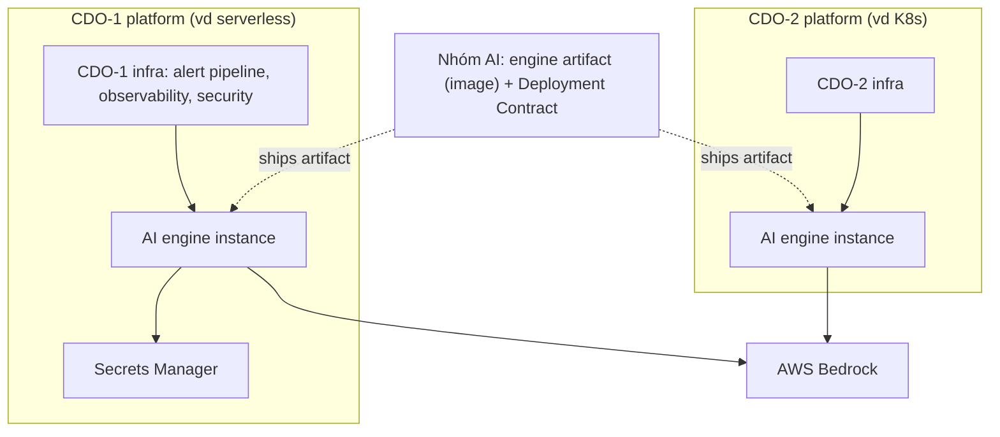

# Deployment Contract - Task force <N>

<!-- Owner: Nhóm AI <N>
     Signed by: AI Lead + CDO Leads × 2-3 + Reviewer panel
     Date signed: 2026-06-25 (W11 T5)
     🔒 FREEZE - no change without formal change request -->

## Mục đích

Định nghĩa **AI Engine cần được deploy như thế nào** - compute target, scale, secrets, network, rollback. Đây là **spec mỗi CDO dựa vào để deploy engine lên platform của mình** + size capacity đúng.

## Key principle

**Nhóm AI giao engine dưới dạng artifact (container image/code) + bản spec deploy này. MỖI trong 2-3 CDO tự deploy engine lên platform riêng của mình** (serverless / K8s / streaming... - mỗi CDO một angle, compete ở chỗ *cách* host). Các giá trị compute/scale/network dưới đây là **spec tham chiếu mỗi CDO phải đáp ứng** (CDO K8s map sang pod/HPA, serverless sang Lambda - miễn tương đương). Mỗi CDO có **endpoint riêng**, mỗi instance isolate multi-tenant theo `tenant_id`.

> **Ngoại lệ tạm (bootstrap):** T5 W11 → đầu W12, AI deploy **1 skeleton endpoint chung** để CDO integrate code path sớm. Đây là giàn giáo, KHÔNG phải nơi engine sống cuối. W12 mỗi CDO host instance thật của mình - đây mới là "deployed trên 2-3 CDO platform" mà rubric chấm.

---

## Compute

| Aspect | Configuration |
|---|---|
| **Target** | ECS Fargate task (hoặc Lambda nếu light load) |
| **Cluster** | `tf-<N>-aiops-cluster` |
| **Service name** | `ai-engine` |
| **Image source** | ECR repo URI + image tag |
| **CPU per task** | 1024 (1 vCPU) |
| **Memory per task** | 2048 MB |

## Scaling

| Aspect | Value |
|---|---|
| **Replicas** | min 2, max 10 |
| **Autoscale trigger 1** | Target CPU 70% |
| **Autoscale trigger 2** | Target request count 100 per task |
| **Scale-up cooldown** | 60 giây |
| **Scale-down cooldown** | 300 giây |
| **Cold start mitigation** | (nếu Lambda) provisioned concurrency = 2 |

## Secrets

| Secret name | Source |
|---|---|
| `BEDROCK_API_KEY` | AWS Secrets Manager: `tf-<N>/ai-engine/bedrock` |
| `AWS_REGION` | env var |

> Không có long-lived access key. Mọi credential rotate qua Secrets Manager rotation policy.

## Networking

| Aspect | Configuration |
|---|---|
| **Subnet type** | private |
| **ALB** | internal only (không public-facing) |
| **Security group** | `tf-<N>-ai-engine-sg` |
| **Ingress rules** | chỉ allow từ services gọi engine trong cùng CDO platform (engine deploy bên trong platform của CDO đó) |
| **Egress rules** | chỉ allow tới Bedrock endpoint + Secrets Manager VPC endpoint |
| **DNS** | resolve được trong VPC (route 53 private hosted zone) |

## Deployment topology diagram

## Per-CDO deployment

> Mỗi CDO deploy engine trên platform riêng → **mỗi CDO một endpoint riêng**. (Skeleton chung chỉ tồn tại giai đoạn bootstrap T5 → đầu W12.)

| CDO platform | Endpoint (instance riêng của CDO) | Auth |
|---|---|---|
| CDO-A1 | `https://ai-engine.cdo-a1.tf-<N>.internal/` | IAM SigV4 |
| CDO-A2 | `https://ai-engine.cdo-a2.tf-<N>.internal/` | IAM SigV4 |
| CDO-A3 | `https://ai-engine.cdo-a3.tf-<N>.internal/` (nếu task force có 3 CDO) | IAM SigV4 |
| _(bootstrap)_ skeleton chung | `https://ai-engine-skeleton.tf-<N>.internal/` (chỉ T5 → đầu W12) | IAM SigV4 |

## Rollout strategy: Canary

| Step | Traffic | Interval |
|---|---|---|
| 1 | 10% | 5 phút |
| 2 | 50% | 5 phút |
| 3 | 100% | - |

**Abort criteria** (bất kỳ điều kiện trigger → auto rollback ngay):

- Error rate > 1%
- P99 latency > 800 ms
- Burn-rate fast alert triggered

## Rollback

| Aspect | Value |
|---|---|
| **Primary method** | ArgoCD rollback to previous git SHA |
| **Secondary method** | ECS service revert (manual) |
| **Target RTO** | < 60 giây |
| **Auto-trigger** | Yes (khi abort criteria met trong canary rollout) |

## Health check

| Field | Value |
|---|---|
| **Path** | `/health` |
| **Port** | 8080 |
| **Interval** | 30 giây |
| **Healthy threshold** | 2 consecutive 200 |
| **Unhealthy threshold** | 3 consecutive non-200 |

## Observability

| Aspect | Configuration |
|---|---|
| **OTel endpoint** | collector URL per CDO platform (config qua env var) |
| **Log destination** | CloudWatch Logs (retention 14 ngày) |
| **Metrics** | Prometheus / CloudWatch (CDO chọn) |
| **Traces** | OpenTelemetry → Jaeger / AWS X-Ray |

## Failure modes & response

| Failure | Detection | Response |
|---|---|---|
| Task crash | ECS health check | Auto-restart |
| Region outage | CloudWatch alarm | Failover secondary region (nếu multi-region) |
| Bedrock throttling | App-level metric | Exponential backoff + fallback rule-based |
| Memory leak | Memory > 90% | Rolling restart |

## Open questions

- [ ] Q1: Multi-region cho disaster recovery - có trong scope capstone không?
- [ ] Q2: Cost cap per task force per ngày - đặt mức nào?
