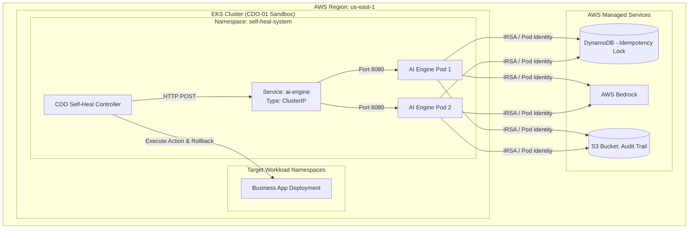

# Deployment Contract - Generic Multi-Tenant Self-Heal Platform

## 1. Mục đích

Tài liệu này xác định **Hợp đồng Triển khai (Deployment Specification)**. Hợp đồng quy định cách thức thiết lập hạ tầng ảo hóa, cơ chế định tuyến, quản lý định danh/bí mật (Secrets), chính sách an toàn Kubernetes RBAC, cơ chế khóa trùng lặp (Idempotency Lock), và các tiêu chuẩn kiểm tra sức khỏe của AI Engine khi tích hợp vào các nền tảng hạ tầng (CDO Platforms).

---

## 1.5. Target Topology: Namespace & Deployment Mapping Conventions

Mục này định nghĩa cấu trúc thiết lập topology hệ thống đích, thiết lập quy chuẩn ánh xạ giữa các dịch vụ nghiệp vụ và các tài nguyên hạ tầng thực tế trên cụm Kubernetes để phục vụ công tác điều khiển tự chữa lành an toàn.

### A. Quy tắc cấu trúc định danh
1. **Target Namespace**: Môi trường chạy các dịch vụ được phân lập theo namespace của Kubernetes. Tên của namespace vận hành dịch vụ (`Target Namespace`) sẽ được cấu hình động dựa trên cấu hình môi trường của từng dự án cụ thể.
2. **Deployment Resource**: Mọi dịch vụ nghiệp vụ (`service`) bắt buộc phải tương ứng với một đối tượng Kubernetes Deployment quản trị. Định dạng định danh tài nguyên chuẩn là `deployment/<deployment_name>`.

### B. Quy chuẩn cấu trúc dữ liệu yêu cầu
Trong mọi giao dịch API liên dịch vụ (như gửi telemetry, lập kế hoạch `/v1/decide`, và báo cáo `/v1/verify`), các trường `namespace` và `deployment` là tùy chọn (optional) và có thể được truyền tải dưới dạng chuỗi ký tự (`string`) theo quy chuẩn sau:
* `namespace`: Tên của K8s namespace đang chứa tài nguyên đích (Tùy chọn, ví dụ: `[operational_namespace_name]`).
* `deployment`: Tên của đối tượng K8s Deployment quản trị trực tiếp dịch vụ bị lỗi (Tùy chọn, ví dụ: `[k8s_deployment_resource_name]`).

### C. Bảng cấu trúc ánh xạ đăng ký dịch vụ (Template Registry)
Dưới đây là cấu trúc bảng mẫu dùng để đăng ký và đối chiếu tài nguyên khi dự án cụ thể được triển khai thực tế:

| Dịch vụ nghiệp vụ (`service`) | K8s Namespace (`namespace`) | Đối tượng Deployment đích (`deployment`) |
|---|---|---|
| `<service_name_1>` | `<target_namespace>` | `deployment/<deployment_name_1>` |
| `<service_name_2>` | `<target_namespace>` | `deployment/<deployment_name_2>` |
| ... | ... | ... |

*Lưu ý an toàn*: CDO Platform có trách nhiệm kiểm tra và xác thực (validate) tính hợp lệ của cặp giá trị `[namespace, deployment]` trước khi thực thi bất kỳ hành động nào lên hạ tầng, đảm bảo hành động nằm hoàn toàn trong phạm vi blast radius cho phép của tenant tương ứng.

---

## 2. Infrastructure Hosting & Offline Testing Strategy

AI Engine được triển khai theo mô hình **Self-Hosted (In-Cluster)**. Nhóm AI chịu trách nhiệm đóng gói ứng dụng thành **OCI-compliant Container Image** và cung cấp tài liệu cấu hình môi trường. Nhóm CDO sẽ tự kéo (pull) image này và triển khai trực tiếp vào bên trong cụm EKS Sandbox của họ.

### A. Compute Configuration (EKS Deployment)

Bảng dưới đây mô tả các thông số triển khai tối thiểu (Resource Requests & Limits) mà CDO team cần cấp phát cho EKS Deployment của AI Engine:

| Aspect | Configuration |
|---|---|
| **Target Compute** | EKS Worker Nodes (hoặc EKS Fargate Profile) |
| **Target Namespace** | `self-heal-system` |
| **K8s Resource Type** | `Deployment` |
| **Container name** | `ai-engine` |
| **Container port** | `8080` |
| **Image source** | ECR repo URI + immutable image tag |
| **CPU Requests / Limits** | 500m / 1000m (0.5 - 1.0 vCPU) |
| **Memory Requests / Limits**| 1024Mi / 2048Mi (1.0 - 2.0 GB) |

### B. Per-Tenant Capacity & Scaling Guardrails

CDO Platform cấu hình Horizontal Pod Autoscaler (HPA) để tự động mở rộng AI Engine:

| Aspect | Value |
|---|---|
| **Replicas** | Min: 2 pods, Max: 10 pods |
| **HPA trigger 1** | Target CPU Utilization >= 70% |
| **HPA trigger 2** | Target Memory Utilization >= 80% |

### C. CDO Platform Integration & Routing

AI Engine không được expose (công khai) ra ngoài Internet. Việc định tuyến gọi API hoàn toàn diễn ra bên trong mạng nội bộ cụm K8s (In-Cluster Routing):

| Trạng thái | Endpoint URL (Ví dụ) | Auth |
|---|---|---|
| **In-Cluster Service** | `http://ai-engine.self-heal-system.svc.cluster.local:8080/` | Local Trust (mTLS tùy chọn) |

### D. Chiến lược chạy thử nghiệm mô phỏng (Offline Simulation Mode)
* Vì dữ liệu thử nghiệm ngoại tuyến được tổ chức dưới dạng tệp dữ liệu tĩnh lịch sử, các hành động thay đổi trạng thái thật (`RESTART_DEPLOYMENT`, `SCALE_REPLICAS`,...) sẽ được **chạy ở chế độ giả lập (Mock Mode)** trong môi trường sandbox của CDO.
* CDO Platform sẽ ghi nhận lệnh gọi từ AI Engine, ghi log kiểm toán tương ứng, và mô phỏng phản hồi thành công. Dữ liệu telemetry phản hồi tiếp theo sẽ được trích xuất từ dữ liệu tĩnh lịch sử sau mốc thời gian lỗi để gửi xác thực.

---

## 3. Kubernetes IRSA & Secrets Management

Để bảo đảm an toàn hạ tầng và tuân thủ các nguyên tắc đặc quyền tối thiểu (Least Privilege), AI Engine áp dụng mô hình **IAM Roles for Service Accounts (IRSA)** hoặc **EKS Pod Identity**. 

### A. Phân tách ranh giới ủy quyền (Execution Boundary)
AI Engine **không** có quyền truy cập trực tiếp vào Kubernetes (EKS) API, đảm bảo phân ranh giới rõ ràng: 
* **AI Engine**: Là bộ não ra quyết định (Brain), chỉ trả về kịch bản hành động (Action Plan).
* **CDO Controller**: Là bàn tay thực thi (Hands), chịu trách nhiệm gọi EKS API để thay đổi trạng thái hạ tầng (Mutate resources).

### B. AWS Secrets Manager Path Conventions
Tất cả các secret liên quan đến AI Engine (như API Key cho LLM Bedrock) phải được lưu trữ trên AWS Secrets Manager hoặc qua External Secrets Operator:
* Base path: `tf-3/ai-engine/bedrock`

*Lưu ý*: Nghiêm cấm hardcode thông tin xác thực trong code hoặc Kube manifests.

### C. Pod IRSA IAM Policy (Runtime - Ví dụ tham chiếu)
IAM Role gắn với ServiceAccount của AI Engine Pod chỉ được phép cấp các quyền truy cập ra bên ngoài AWS Services:
```json
{
  "Version": "2012-10-17",
  "Statement": [
    {
      "Sid": "DynamoDBIdempotencyLock",
      "Effect": "Allow",
      "Action": [
        "dynamodb:GetItem",
        "dynamodb:PutItem",
        "dynamodb:UpdateItem"
      ],
      "Resource": "arn:aws:dynamodb:us-east-1:*:table/tf-3-aiops-idempotency-lock"
    },
    {
      "Sid": "S3AuditTrailWrite",
      "Effect": "Allow",
      "Action": [
        "s3:PutObject",
        "s3:GetObject"
      ],
      "Resource": "arn:aws:s3:::tf-3-aiops-audit-trail/*"
    },
    {
      "Sid": "BedrockInvokeModel",
      "Effect": "Allow",
      "Action": [
        "bedrock:InvokeModel",
        "bedrock:InvokeModelWithResponseStream"
      ],
      "Resource": "arn:aws:bedrock:us-east-1::foundation-model/*"
    }
  ]
}
```

**Điều khoản cấm (Forbidden Actions)**: Role của AI Engine tuyệt đối không được cấp quyền `iam:*`, `ec2:*` hoặc các hành động sửa đổi hạ tầng mạng. **Đặc biệt, cấm cấp quyền Kubernetes API (`eks:*`) hoặc lưu trữ `kubeconfig` trực tiếp trong môi trường chạy của AI Engine**, đảm bảo AI Engine không thể tự ý thay đổi trạng thái cụm K8s.

---

## 4. Idempotency Lock & Audit Logging (SOC2 Compliance)

### A. Idempotency Lock

#### 1. Tại sao cần Idempotency Lock?
Trong môi trường phân tán, CDO Controller có thể gửi yêu cầu gọi API `/v1/decide` hoặc thực thi hành động nhiều lần do cơ chế tự động thử lại (Retry). Nếu không có khóa, hành động sửa lỗi có thể bị thực thi trùng lặp, gây mất ổn định nghiêm trọng.

#### 2. Nguyên lý hoạt động
1. Mỗi quyết định tại `/v1/decide` bắt buộc kèm theo một `Idempotency-Key`.
2. Hệ thống kiểm tra khóa này trong cơ sở dữ liệu khóa (DynamoDB/Redis).
3. Nếu khóa **chưa tồn tại**: Tiến hành xử lý.
4. Nếu khóa **đã tồn tại**: Từ chối và trả về `409 Conflict`.

### B. Tamper-Evident Audit Logging
- Mọi chu kỳ xử lý bắt buộc phải được ghi nhật ký hoạt động đầy đủ.
- Sử dụng **Amazon S3 Object Lock** ở chế độ **Compliance mode** với thời gian giữ tối thiểu **90 ngày**.
- CDO platform cung cấp giao diện truy vấn nhật ký kiểm toán (như Athena).

### C. Bedrock Cost Cap & Budget Alerting (Quản trị chi phí LLM)
1. **Hạn mức Chi phí (Cost Cap)**: Giới hạn **$50/ngày** trên mỗi Tenant.
2. **Cảnh báo (Alerting)**: Đạt 80% ($40) sẽ bắn cảnh báo. Đạt 100% ($50) sẽ kích hoạt Circuit Breaker.
3. **Cơ chế Fallback Rule-Based**: Sau khi vượt hạn mức, `/v1/decide` sẽ tự động chuyển sang fallback rule-based không gọi LLM, kèm cảnh báo `"cost_cap_exceeded": true`.

---

## 5. Networking & Security Policies

Vì AI Engine triển khai dạng EKS-local, việc bảo mật mạng phụ thuộc vào K8s Network Policies thay vì AWS Security Groups.

### A. Network Policy (Ingress)
Chỉ cho phép Ingress Traffic (đi vào cổng 8080 của AI Engine) xuất phát từ các Pods thuộc namespace hệ thống có dán nhãn hợp lệ (ví dụ: `app=cdo-self-heal-controller`). Chặn toàn bộ traffic từ Internet hoặc từ các namespace nghiệp vụ khác.

### B. Network Policy (Egress)
Chỉ cho phép Egress Traffic gọi ra ngoài qua giao thức HTTPS (Port 443) tới các AWS VPC Endpoints (S3, DynamoDB, Bedrock). Cấm Egress vào lại K8s API Server (`kubernetes.default.svc`).

### C. Deployment Topology Diagram (CDO-01 Sandbox)



---

## 6. Rollback & Deployment Pipeline

Khác với mô hình ECS dùng CodeDeploy, việc quản lý vòng đời ứng dụng của AI Engine giờ đây là trách nhiệm của công cụ GitOps (ví dụ: ArgoCD hoặc FluxCD) nằm bên trong cụm CDO.

### A. Rollout Strategy
CDO sử dụng K8s Deployment `RollingUpdate` (MaxSurge: 25%, MaxUnavailable: 0) hoặc ArgoCD Rollouts cho luồng Canary.

### B. Tiêu chuẩn dừng khẩn cấp (Abort Criteria)
Hệ thống giám sát của CDO sẽ kích hoạt Rollback khi:
- Tỷ lệ lỗi API (`5xx` error rate) của AI Engine > `1.0%`.
- Độ trễ phản hồi p99 > `800 ms`.
- Kiểm tra sức khỏe (Liveness probe) thất bại.

---

## 7. Health Check & Readiness Probes

CDO cần cấu hình các K8s Probes gọi vào các HTTP endpoints sau trên container port `8080` của AI Engine:

### A. Liveness Probe (`GET /health`)
* **Mục đích**: Kiểm tra trạng thái sống của container.

### B. Readiness Probe (`GET /ready`)
* **Mục đích**: Trả về `"ready"` khi AI Engine đã khởi tạo thành công kết nối tới Bedrock/DDB/S3.

### C. K8s Probes Configuration (Khuyến nghị)
* `initialDelaySeconds`: 15
* `periodSeconds`: 10
* `failureThreshold`: 3

---

## 8. Failure Modes & Response & Observability

### A. Observability
- **Logs**: Fluend/Promtail thu thập stdout và gửi về CloudWatch/Loki.
- **Metrics**: AI Engine expose endpoint `/metrics` định dạng Prometheus.
- **Traces**: Định dạng OpenTelemetry.

### B. Failure Modes & Response Action Table

| Failure Mode | Detection | Response |
|---|---|---|
| **Pod crash / OOMKilled** | K8s Kubelet | K8s ReplicaSet tự động khởi động lại Pod |
| **Bedrock API Throttling (429)** | Lỗi từ SDK | Áp dụng Exponential Backoff + Fallback Rule-Based |
| **Rò rỉ bộ nhớ (Memory Leak)** | Pod Memory > Limit | K8s OOMKilled và tự động khởi động lại pod mới |
| **Mất kết nối DDB/S3** | Readiness Probe Fail | Pod bị tháo khỏi Service endpoints, ngừng nhận traffic |