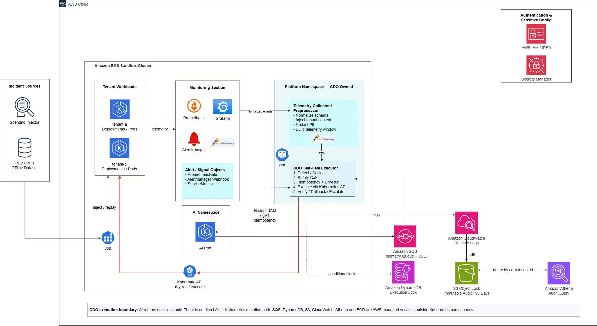
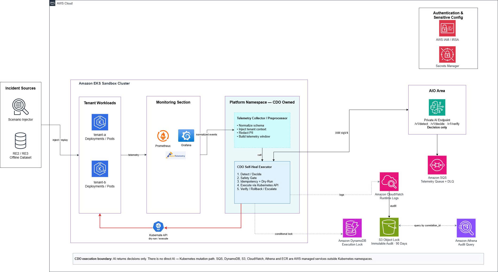

# Infrastructure Design - Task Force 3 Self-Heal Engine - CDO-02

**Doc owner:** CDO-02  
**Trạng thái:** Ready for W11 Pack #1 review  
**Cập nhật lần cuối:** 2026-06-26 (sync contract-new-4)  

## 1. Mục tiêu kiến trúc

CDO-02 thiết kế platform để Self-Heal Engine chạy an toàn trên Kubernetes/EKS. AI team cung cấp decision service qua các endpoint `/v1/detect`, `/v1/decide`, `/v1/verify`; CDO-02 chịu trách nhiệm thu thập telemetry, gọi AI, kiểm tra safety, execute action, verify, rollback/escalate và ghi audit.

Angle của CDO-02 là **K8s-heavy / Kubernetes Workflow Orchestration**. Trọng tâm không phải chỉ deploy AI, mà là xây lớp orchestration kiểm soát mọi hành động tự chữa lỗi trên Kubernetes.



## 2. Đọc nhanh: hệ thống này chạy như thế nào?

Nói ngắn gọn, CDO-02 xây một "người điều phối" nằm giữa alert, AI và Kubernetes:

```text
Alert xảy ra
-> CDO gom logs/metrics/traces
-> CDO hỏi AI: "đây là lỗi gì?"
-> CDO hỏi AI: "nên làm action gì?"
-> CDO kiểm tra action đó có an toàn không
-> Nếu an toàn thì CDO execute trên Kubernetes
-> CDO verify lại kết quả
-> CDO ghi audit
```

Điểm quan trọng: **AI không tự ý sửa Kubernetes**. AI chỉ trả `action_plan`; CDO executor mới là nơi quyết định có được execute hay không sau khi qua safety gate.

### 2.1 Các thành phần chính, hiểu đơn giản

| Thành phần | Hiểu đơn giản là gì? | Ai phụ trách? |
|---|---|---|
| Alert Source / Scenario Injector | Nơi tạo sự cố giả hoặc alert thật | CDO |
| Telemetry Collector | Bộ gom logs, metrics, traces để gửi AI | CDO |
| AI Engine | Bộ não phân tích lỗi và đề xuất action | AI team |
| CDO Self-Heal Executor | Bộ điều phối workflow self-heal | CDO |
| Safety Gate | Chốt chặn an toàn trước khi execute | CDO |
| Kubernetes API | Nơi CDO thực hiện restart/scale/patch | CDO dùng |
| Audit Storage | Nơi ghi lại toàn bộ quá trình xử lý | CDO |

### 2.2 Vì sao không cho AI execute trực tiếp?

Nếu AI gọi Kubernetes trực tiếp, CDO khó đảm bảo:

- AI có thao tác đúng namespace không.
- AI có vượt blast-radius không.
- Action có local rollback/runbook path và `verify_policy` không.
- Có audit đầy đủ trước và sau action không.

Vì vậy CDO-02 chọn boundary:

```text
AI = decide
CDO = validate + execute + verify + audit
```

## 3. Sơ Đồ Kiến Trúc



Caption: CDO executor là điểm điều phối chính. AI chỉ đưa ra decision/action plan theo contract. CDO executor enforce safety gate, gọi Kubernetes API khi action được phép, sau đó verify và ghi audit.

## 4. Bảng Thành Phần

| Component | Service/Technology | Vai trò | Ghi chú |
|---|---|---|---|
| Kubernetes sandbox | EKS/Kubernetes | Chạy sample workloads và namespaces tenant | Target chính của self-heal |
| CDO Self-Heal Executor | Pod/Deployment trong EKS | Điều phối detect -> decide -> safety -> execute -> verify | CDO own |
| Telemetry Collector | CloudWatch/Container Insights/Prometheus/OpenTelemetry | Thu logs, metrics, traces theo contract AI | CDO chuẩn hóa data trước khi gọi AI |
| Optional Telemetry Buffer | Amazon SQS (CDO internal buffer) | Buffer telemetry đã chuẩn hóa từ RE2/RE3 preprocessor hoặc runtime collector trước khi forward sang AI `/v1/detect` | CDO owns; telemetry contract xác nhận SQS là CDO-internal, AI không pull từ SQS |
| AI Engine | OCI container image do AI bàn giao, CDO tự host in-cluster trên EKS | Decision service do AI team build, CDO deploy/runtime-own | Contract mới nhất chốt namespace `self-heal-system`, service nội bộ cluster và mô hình self-hosted |
| Safety Gate | Module trong executor | Validate tenant, namespace, confidence threshold, action allow-list, `allowed_namespaces`, blast-radius, `verify_policy` | Chặn unsafe action (app-level) |
| Kyverno Admission | K8s Admission Webhook (namespace `kyverno`) | Enforce value-level constraints: replicas ≤ 10, memory ≤ 4Gi, namespace allowlist | Lớp 3 độc lập với executor code |
| Idempotency Lock | DynamoDB conditional write | Chống execute trùng cùng `Idempotency-Key` | Khớp deployment contract AI |
| Audit Storage | S3 Object Lock | Ghi audit tamper-evident, retention >=90 ngày | Theo contract AI |
| Logs | CloudWatch Logs | Logs executor, AI request/response, safety decision | Query theo `correlation_id` |
| Metrics | Prometheus-compatible / CloudWatch Metrics | Error rate, latency, memory, restart count | Dùng cho detect/verify |
| Traces | OpenTelemetry -> X-Ray/Jaeger | Trace lỗi liên service | Theo contract AI, triển khai W12 nếu kịp |

## 5. Luồng Xử Lý Chính

```text
1. Alert source hoặc scenario injector tạo incident.
2. Telemetry collector/preprocessor gom metrics/logs/traces theo telemetry contract.
3. Telemetry enqueue vào SQS (CDO-internal buffer). CDO worker dequeue theo rate limit (≤100 RPS/tenant cho /v1/detect).
   Với RE2/RE3 Offline Simulation Mode: preprocessor đọc CSV → enqueue SQS → worker forward sang AI.
4. CDO executor gọi AI /v1/detect với telemetry payload.
5. CDO chạy Pre-Decide Gate dựa trên detect response — quyết định có gọi /v1/decide không:
   - anomaly_detected=false → đóng incident, ghi audit no_anomaly, kết thúc.
   - confidence < 0.5 → discard (likely noise), ghi log warning.
   - confidence 0.5–0.79 + severity LOW/MEDIUM → log warning, không action.
   - confidence 0.5–0.79 + severity HIGH/CRITICAL → escalate ngay, ghi audit low_confidence_escalated.
   - Flapping: cùng service detect lần 3+ trong 10 phút → escalate, ghi audit flapping_escalated.
   - Maintenance window active → suppress, ghi audit maintenance_suppressed.
   - confidence >= 0.8 + severity MEDIUM/HIGH/CRITICAL → tiếp tục gọi /v1/decide.
   CDO KHÔNG filter theo fault type — AI tự trả confidence thấp nếu không match được pattern.
6. AI trả matched_runbook, action_plan[], pattern_type, blast_radius_config, verify_policy, cost_cap_exceeded.
7. Safety gate validate: tenant_id, namespace, allowed_namespaces, blast-radius, rollback plan, verify_policy, idempotency key, action allow-list.
8a. [URGENT PATH] Nếu pattern_type = "urgent":
    - CDO capture rollback snapshot TRƯỚC khi execute: đọc K8s API lấy current state
      (memory_limit, replica_count, image_tag) → lưu vào audit log (AI không trả rollback_snapshot)
    - CDO executor gọi Kubernetes API trực tiếp (RESTART_DEPLOYMENT, PATCH_MEMORY_LIMIT, ROLLOUT_UNDO)
    - Chạy server-side dry-run trước, nếu pass thì execute thật
    - RTO target < 60 giây
8b. [DEFERRED PATH] Nếu pattern_type = "deferred":
    - CDO capture rollback snapshot TRƯỚC khi execute: ghi Git commit SHA hiện tại → lưu vào audit log
    - CDO executor KHÔNG gọi Kubernetes API
    - Executor tạo Git commit cập nhật manifest (ROTATE_SECRET, SCALE_REPLICAS)
    - ArgoCD phát hiện commit → sync vào cluster (~30-60s)
    - Executor poll ArgoCD status chờ Synced + Healthy
9. Executor ghi nhận action result (K8s response hoặc ArgoCD sync status).
10. Executor thu post-action telemetry hoặc đọc post_telemetry_window từ dataset.
11. Executor gọi AI /v1/verify với post_telemetry_window.
12. Nếu success → close incident, ghi audit.
13. Nếu regression/fail:
    - Urgent path: kubectl rollout undo hoặc revert patch
    - Deferred path: tạo revert commit → ArgoCD sync về trạng thái cũ
    - Nếu rollback không an toàn → escalate với context bundle
```

## 6. AI Contract Integration

CDO-02 consume AI API Contract như sau:

| API | CDO usage |
|---|---|
| `POST /v1/detect` | Gửi telemetry/context để AI xác định anomaly. Bắt buộc: `Idempotency-Key`, `X-Dry-Run-Mode` |
| `POST /v1/decide` | **Request bắt buộc**: `anomaly_context` (full object từ detect response — contract-new-4). **Response required**: `matched_runbook`, `pattern_type`, `action_plan[]` (target là string "deployment/\<name\>"), `blast_radius_config`, `verify_policy`, `correlation_id`, `idempotency_key`, `dry_run_mode` (echoed back), `cost_cap_exceeded` (optional). **⚠ AI KHÔNG trả `rollback_snapshot`** — CDO tự capture trước khi execute: urgent path → đọc K8s API lấy current state (memory_limit, replica_count, image_tag) → lưu audit log; deferred path → ghi Git commit SHA hiện tại → dùng để revert khi `next_action=ROLLBACK` |
| `POST /v1/verify` | **Request bắt buộc**: `correlation_id`, `idempotency_key`, `dry_run_mode`, `action_executed`, `post_telemetry_window` (required từ contract-new-4). **Response**: `success`, `regression_detected`, `next_action` (DONE/RETRY/ROLLBACK/ESCALATE), `escalation_bundle` (khi `next_action=ESCALATE`: `{ reason, logs, metrics }`) |

Headers/auth theo contract:

```text
X-Tenant-Id: 6c8b4b2b-4d45-4209-a1b4-4b532d56a31c      ← confirmed chính thức (contract-new-2)
Idempotency-Key: UUID v4 (bắt buộc 3 endpoints)
X-Dry-Run-Mode: "true" hoặc "false" (bắt buộc 3 endpoints)
X-Correlation-Id: UUID v4 (tùy chọn detect; bắt buộc decide/verify)
```
Không dùng Authorization SigV4 — AI endpoint dùng K8s NetworkPolicy in-cluster (Local Trust).

SLA và abort criteria theo contract-new-4:

| Endpoint | p99 target | Abort threshold | Rate limit |
|---|---|---|---|
| `/v1/detect` | < 300ms | p99 > 800ms hoặc 5xx > 1% → trigger rollback | 100 RPS/tenant |
| `/v1/decide` | < 3000ms (LLM) / < 500ms (rule fallback) | p99 > 3000ms hoặc 5xx > 1% → trigger rollback | 10 RPS/tenant |
| `/v1/verify` | < 500ms | p99 > 1000ms hoặc 5xx > 1% → trigger rollback | 10 RPS/tenant |

Các action CDO sẽ hỗ trợ theo allow-list:

```text
RESTART_DEPLOYMENT
PATCH_MEMORY_LIMIT
SCALE_REPLICAS
ROLLOUT_UNDO
ROTATE_SECRET    ← confirmed build thật (trigger: secret_expiry_warning, pattern_type: deferred)
```

> **Auth note (updated new contract)**: Auth cho AI endpoint là **Local Trust + K8s NetworkPolicy** (mTLS tùy chọn). CDO Executor không cần sign SigV4 để gọi AI in-cluster — K8s NetworkPolicy kiểm soát truy cập. IRSA/EKS Pod Identity vẫn cần cho CDO gọi AWS services (S3, DynamoDB, CloudWatch).

**Xử lý `pattern_type` (bắt buộc):**

| `pattern_type` | CDO action |
|---|---|
| `"urgent"` | Execute trực tiếp qua Kubernetes API sau safety gate pass (RTO < 60s) |
| `"deferred"` | Tạo Git commit/PR để ArgoCD sync. **Không direct mutate Kubernetes** |

**Xử lý `cost_cap_exceeded: true`:** AI đã chuyển sang rule-based fallback (4 trigger: chi phí > $50/ngày, Bedrock 429, AI timeout, LLM parse failure). CDO vẫn execute action plan nhưng phải log cảnh báo, thông báo team.

**Idempotency lock scope (contract-new-4):** DynamoDB conditional write lock CHỈ áp dụng cho `/v1/decide` — ngăn duplicate execution. `/v1/detect` và `/v1/verify` gửi `Idempotency-Key` cho audit trail, không lock.

**HTTP error codes CDO phải xử lý:**

| Code | Nghĩa | CDO action |
|---|---|---|
| `400` | Malformed request | Không retry; ghi audit; đưa vào DLQ nếu là telemetry |
| `401 Unauthorized` | Local Trust / mTLS config sai hoặc phân quyền tenant không hợp lệ | Không retry; kiểm tra NetworkPolicy và ServiceAccount config; ghi audit `auth_config_error` |
| `403 Forbidden` | `X-Tenant-Id` không khớp `tenant_id` trong payload | Không retry; ghi audit `tenant_mismatch`; kiểm tra header config |
| `409` | Trùng `Idempotency-Key` | Không retry; incident đã được xử lý trước đó |
| `429` | Rate limit | Exponential backoff theo header `Retry-After` |
| `500` | Lỗi nội bộ AI Engine | Retry tối đa **2 lần** với exponential backoff (1s, 3s); nếu vẫn thất bại → escalate + audit `ai_internal_error` |
| `503` | AI unavailable (upstream Bedrock/DDB/S3 down) | Không retry; escalate + audit `ai_unavailable_escalated`; không execute mặc định |

**Telemetry DLQ:** Khi AI reject telemetry (400), CDO chuyển message vào Dead-Letter Queue để phân tích. Alert nếu tỷ lệ malformed > 0.5% trong 5 phút.

W11 Pack #1 chỉ chốt design và contract alignment. Theo AI API Contract, RE2/RE3 Offline Simulation Mode chạy ở dạng **Mock Mode**: CDO ghi nhận action giả định đã thực hiện, rồi gửi `post_telemetry_window` từ dataset sang `/v1/verify`. Nếu trainer yêu cầu, CDO-02 sẽ bổ sung demo action thật trên Kubernetes sandbox ở W12.

## 6.1. Ghi chú quan trọng về mô hình hosting AI

Sau khi pull repo AI mới nhất tại commit `08ed368`, CDO-02 xác nhận contract triển khai đã chốt rõ:

```text
AI team build container image
-> CDO pull image
-> CDO deploy AI Engine trực tiếp vào EKS của mình
-> CDO controller gọi AI qua service nội bộ trong cluster
```

Các điểm hạ tầng cần bám theo contract mới:

- Namespace mục tiêu: `self-heal-system`
- Resource type: Kubernetes `Deployment`
- Kênh gọi nội bộ: `http://ai-engine.self-heal-system.svc.cluster.local:8080/`
- AI Engine không expose public Internet
- AI Engine dùng IRSA hoặc EKS Pod Identity để gọi Bedrock, S3, DynamoDB
- AI Engine không có quyền gọi EKS API; CDO controller vẫn là bên execute

## 7. Multi-Tenant Approach

CDO-02 dùng namespace-based tenant isolation:

```text
tenant-a namespace
tenant-b namespace
platform namespace
```

Nguyên tắc:

- Mọi request phải có `tenant_id`.
- Mọi Kubernetes target phải nằm trong namespace tương ứng tenant.
- Executor không được thao tác cross-namespace nếu action plan không khớp tenant.
- ServiceAccount/RoleBinding tách theo namespace.
- Audit log ghi `tenant_id`, namespace, action, result, correlation_id.

### 7.1 Tenant Onboarding Flow

Trong capstone, CDO-02 chỉ cần tối thiểu 2 tenants để chứng minh isolation. Tenant onboarding dự kiến:

```text
1. Tạo namespace tenant mới.
2. Tạo Role/RoleBinding giới hạn trong namespace đó.
3. Deploy sample workload cho tenant.
4. Gắn labels/annotations: tenant_id, service, environment.
5. Chạy smoke test: alert -> AI -> safety gate -> deny/execute đúng namespace.
```

### 7.2 Noisy Neighbor Mitigation

- Giới hạn action theo tenant namespace.
- Không cho một incident scale/restart nhiều deployment cùng lúc nếu vượt blast-radius.
- Rate limit request theo `X-Tenant-Id` theo AI API contract.
- Audit mọi action bị deny do cross-tenant hoặc vượt blast-radius.

## 8. Safety Gate

Safety gate là lớp kiểm tra trước khi CDO thực hiện bất kỳ action nào trên Kubernetes. Có thể hiểu đây là "bộ phanh an toàn" của hệ thống self-heal.

> **Phân biệt Pre-Decide Gate vs Safety Gate:**
> - **Pre-Decide Gate** (Section 5, step 5): chạy SAU `/v1/detect`, TRƯỚC `/v1/decide`. Hỏi "có nên để hệ thống tự xử lý không?" — dựa trên confidence, severity, flapping, maintenance window.
> - **Safety Gate** (Section 8): chạy SAU `/v1/decide`, TRƯỚC execute. Hỏi "action này có an toàn để execute không?" — dựa trên tenant match, action allow-list, blast-radius, rollback plan.

Ví dụ: nếu AI trả về "restart deployment tenant-b/api-service" nhưng incident đang thuộc `tenant-a`, safety gate phải chặn ngay và ghi audit.

Safety gate bắt buộc kiểm tra:

| Check | Rule |
|---|---|
| Tenant match | `tenant_id` phải khớp namespace target |
| Action allow-list | Chỉ cho phép action đã định nghĩa trong AI contract |
| Blast-radius | Không vượt số deployment/replica giới hạn |
| Rollback plan | Bắt buộc có với action mutate |
| Verify plan | Bắt buộc có metric/log để verify sau action |
| Idempotency | Không execute trùng cùng `Idempotency-Key`; ưu tiên DynamoDB conditional write |
| `pattern_type` routing | `"urgent"` → execute trực tiếp K8s sau safety pass; `"deferred"` → bắt buộc Git commit/PR path |
| `cost_cap_exceeded` | Nếu `true`: log + notify team, vẫn execute nhưng không escalate cost thêm |
| Failure fallback | AI 503/timeout -> escalate + audit, không execute mặc định |

## 8.1 Admission Control Layer — Kyverno

### Vấn đề Safety Gate chưa giải quyết

Safety gate trong Section 8 là **app-level check**: chạy trong process của CDO executor. Có 2 khoảng trống mà safety gate không bịt được:

1. **Executor code bug → safety gate bypass**: Nếu executor có lỗi, request vẫn đến Kubernetes API và được execute mà không có gì chặn ở cluster level.
2. **RBAC giới hạn verb, không giới hạn value**: RBAC cho phép executor `patch` Deployment, nhưng không ngăn được `replicas: 1000` hay `memory: 100Gi` — Kubernetes sẽ accept bất kỳ value nào trong phạm vi verb được phép.

### Giải pháp: Kyverno Admission Webhook (Lớp 3)

Kyverno chạy như một **Kubernetes Admission Webhook**, được API Server gọi trước khi persist bất kỳ resource nào vào etcd. Đây là lớp thứ 3 hoàn toàn độc lập với executor code:

```text
CDO Executor Code
      ↓
[Lớp 1] Safety Gate (app-level: tenant, blast-radius, confidence, idempotency)
      ↓
Kubernetes API Server
      ↓
[Lớp 2] RBAC (verb-level: "được làm action này không?")
      ↓
[Lớp 3] Kyverno Admission Webhook (value-level: "giá trị có an toàn không?")
      ↓
etcd (resource được persist)
```

Kyverno kiểm tra **value** của request. Ngay cả khi executor code bị bypass hoặc bug, Kyverno vẫn enforce policy độc lập ở cluster level.

### Cài đặt

Kyverno được cài qua Helm vào namespace `kyverno`:

```bash
helm repo add kyverno https://kyverno.github.io/kyverno/
helm install kyverno kyverno/kyverno \
  --namespace kyverno \
  --create-namespace \
  --set admissionController.replicas=1
```

### ClusterPolicy — 3 policy chính

#### Policy 1: Giới hạn replicas tối đa

Trực tiếp xử lý khoảng trống RBAC trainer chỉ ra: `scale --replicas=1000` sẽ bị chặn ở đây dù RBAC cho phép verb `patch`.

```yaml
apiVersion: kyverno.io/v1
kind: ClusterPolicy
metadata:
  name: restrict-replicas-tenant-namespaces
  annotations:
    policies.kyverno.io/description: >
      Chặn SCALE_REPLICAS vượt sandbox cap. RBAC không kiểm soát được value —
      Kyverno là lớp enforce duy nhất cho giới hạn này.
spec:
  validationFailureAction: Enforce
  background: false
  rules:
  - name: max-replicas-10
    match:
      any:
      - resources:
          kinds: ["Deployment"]
          namespaces: ["tenant-a", "tenant-b"]
    validate:
      message: >
        Replicas không được vượt quá 10 trong sandbox CDO-02.
        Giá trị yêu cầu: {{ request.object.spec.replicas }}.
        Nếu cần scale hơn, phải qua approval thủ công.
      pattern:
        spec:
          replicas: "<=10"
```

#### Policy 2: Giới hạn memory limit tối đa

Chặn `PATCH_MEMORY_LIMIT` set memory vượt ceiling sandbox — bảo vệ node không bị starve bởi 1 container.

```yaml
apiVersion: kyverno.io/v1
kind: ClusterPolicy
metadata:
  name: restrict-memory-limit-tenant-namespaces
  annotations:
    policies.kyverno.io/description: >
      Chặn PATCH_MEMORY_LIMIT vượt 4Gi per container trong tenant namespaces.
spec:
  validationFailureAction: Enforce
  background: false
  rules:
  - name: max-memory-limit-4gi
    match:
      any:
      - resources:
          kinds: ["Deployment"]
          namespaces: ["tenant-a", "tenant-b"]
    validate:
      message: "Memory limit per container không được vượt 4Gi trong sandbox CDO-02."
      foreach:
      - list: "request.object.spec.template.spec.containers[]"
        deny:
          conditions:
            any:
            - key: "{{ element.resources.limits.memory || '0' }}"
              operator: GreaterThan
              value: "4Gi"
```

#### Policy 3: Namespace allowlist cho workload mutation

Ngăn CDO executor (hoặc bất kỳ actor nào) mutate Deployment ngoài tenant namespace được phép — defense-in-depth cho cross-tenant attack.

```yaml
apiVersion: kyverno.io/v1
kind: ClusterPolicy
metadata:
  name: restrict-workload-mutation-namespace
  annotations:
    policies.kyverno.io/description: >
      Deny Deployment CREATE/UPDATE trong bất kỳ namespace nào ngoài allowlist.
      Allowlist: tenant-a, tenant-b, kyverno, argocd, self-heal-system, platform, kube-system.
spec:
  validationFailureAction: Enforce
  background: false
  rules:
  - name: allowed-namespaces-only
    match:
      any:
      - resources:
          kinds: ["Deployment"]
          operations: ["CREATE", "UPDATE"]
    exclude:
      any:
      - resources:
          namespaces: ["tenant-a", "tenant-b", "kyverno", "argocd", "self-heal-system", "platform", "kube-system"]
    validate:
      message: >
        Namespace '{{ request.namespace }}' không nằm trong allowlist.
        Deployment mutation chỉ được phép trong: tenant-a, tenant-b, kyverno, argocd, self-heal-system, platform, kube-system.
      deny: {}
```

### Bảng tổng hợp 3 lớp bảo vệ

| Lớp | Cơ chế | Kiểm soát | Điểm yếu còn lại |
|---|---|---|---|
| 1. Safety Gate (code) | App-level check trong executor | Tenant match, blast-radius, confidence, idempotency, pattern_type routing | Bypass nếu executor có bug |
| 2. Kubernetes RBAC | K8s API authorization | "Verb nào được phép trên resource nào" | Không kiểm soát value của request |
| 3. Kyverno Admission | K8s Admission Webhook | "Value có hợp lệ không" (replicas, memory, namespace) | Chỉ enforce policy đã khai báo |

Với 3 lớp này, "Zero unsafe action" không còn phụ thuộc đơn lẻ vào executor code — Kyverno enforce độc lập ở cluster level trước khi bất kỳ thay đổi nào được persist vào etcd.

---

## 9. Observability Design

Observability là phần giúp AI và CDO hiểu chuyện gì đang xảy ra trong hệ thống. Với TF3, CDO ưu tiên thu thập 3 loại dữ liệu:

- **Metrics:** số liệu như latency, error rate, memory usage.
- **Logs:** log lỗi từ application.
- **Traces:** dấu vết request đi qua nhiều service.

AI cần các dữ liệu này để detect/decide/verify. CDO cần các dữ liệu này để chứng minh action đã xử lý lỗi thật hay chưa.

### 9.0 Telemetry pipeline (đã implement, telemetry-contract §2.5.C)

```text
podinfo/nodes/kube-state-metrics → Prometheus (kube-prometheus-stack, ns monitoring)
   → PrometheusRule fire → Alertmanager → webhook → Alert Forwarder (forwarder/)
   → chuẩn hóa telemetry signal → Amazon SQS (cdo-telemetry-dev, đã có)
   → Executor SQS consumer (executor/sqs_source.py) → handle_incident (/v1/detect…)
Grafana: dashboard cluster-health/OOM/restarts (datasource Prometheus).
```

- **Nguồn chính**: SQS (Forwarder ← Alertmanager). **Fallback**: Executor poll K8s pod-status 30s (`watcher.py`) khi SQS rỗng/lỗi.
- **Cadence hybrid** đúng contract §5: event nguy cấp real-time (OOM/unhealthy), metric định kỳ (memory/restart 15s, latency/error cửa sổ 1 phút).
- Deploy: `infra/modules/monitoring` (Helm phase-2) + `manifests/monitoring/*` + `manifests/forwarder/*`. Chi tiết: `09_deploy_runbook_live.md`.

Telemetry theo contract AI (12 signals, 4 lớp):

| Signal | Lớp | Source dự kiến | Trigger action |
|---|---|---|---|
| `service_error_rate` | Application & Service | Prometheus/Istio metrics | detect, verify |
| `service_latency_p95` | Application & Service | Prometheus histogram / CloudWatch | detect service stuck |
| `service_throughput_rps` | Application & Service | Prometheus / OTel | detect tải bất thường, scale decision |
| `application_log_event` | Application & Service | CloudWatch Logs parser + PII scrubbing | chẩn đoán code-level fault |
| `distributed_trace_error_event` | Application & Service | OpenTelemetry / X-Ray / Jaeger | chẩn đoán lỗi liên service |
| `container_resource_usage` | Infrastructure & Container | Container Insights / cAdvisor | detect memory leak, OOM prevention |
| `pod_oom_event` | Infrastructure & Container | K8s Node lifecycle event | urgent → `PATCH_MEMORY_LIMIT` hoặc escalate |
| `container_restart_count` | Infrastructure & Container | kube-state-metrics | detect CrashLoopBackOff → `ROLLOUT_UNDO` |
| `service_unhealthy` | Infrastructure & Container | K8s Kubelet probe monitor | urgent → `RESTART_DEPLOYMENT` |
| `queue_backlog` | Middleware & Dependencies | SQS/RabbitMQ metrics collector | deferred → `SCALE_REPLICAS` |
| `db_connection_pool_saturation` | Middleware & Dependencies | Database monitor / APM agent | detect DB connection exhaustion |
| `secret_expiry_warning` | Security & Compliance | Secrets Manager / Cert Manager event | deferred → `ROTATE_SECRET` |

Với Offline Simulation Mode, nguồn chính là `metrics.csv`, `logs.csv`, `traces.csv` từ RE2/RE3; CDO preprocessor tính toán signal phái sinh, inject tenant UUID, rồi đưa vào executor/AI API path. SQS là buffer nội bộ của CDO (đã được telemetry contract xác nhận); AI Engine không pull từ SQS - CDO dùng Forwarder/Worker để batch-push từ SQS sang `/v1/detect`.

## 10. Chiến Lược Scale

Scaling trong Pack #1 được thiết kế ở mức khả thi cho W12 demo, không phải production blueprint.

| Layer | Scaling approach | Trigger |
|---|---|---|
| CDO executor | Kubernetes Deployment replicas | CPU, request count, queue length nếu có |
| Telemetry collector | Scale theo log/metric volume | CloudWatch/Prometheus scrape load |
| Optional telemetry buffer | SQS buffer if enabled | Queue depth / age of oldest message |
| AI Engine | Deployment + HPA trên EKS của CDO. Compute: CPU 500m req / 1000m limit; Memory 1024Mi req / 2048Mi limit. HPA: Min 2, Max 10 replicas; scale khi CPU ≥ 70% hoặc Memory ≥ 80% (contract-new-2) | CPU utilization, Memory utilization |
| Workload target | Theo AI action plan và safety gate | Queue backlog, latency/error rate |

Nguyên tắc scale:

- Scale action phải nằm trong allow-list và blast-radius.
- Không scale cross-tenant.
- Mọi scale action phải có `verify_policy`.
- Nếu AI confidence thấp hoặc verify signal thiếu, CDO escalate thay vì scale.

## 11. Failure Modes Và Cách Khôi Phục

Phần này liệt kê các lỗi có thể xảy ra trong quá trình self-heal và cách CDO xử lý. Mục tiêu là khi có lỗi, hệ thống fail-safe: **không execute bừa**, mà deny/escalate/audit.

| Failure | Detection | Recovery |
|---|---|---|
| AI endpoint timeout/503 | HTTP client timeout/error | Không execute, escalate + audit |
| AI response thiếu `verify_policy` hoặc namespace/action invalid | Schema/safety validation fail | Deny action, audit reason |
| Cross-tenant target | Safety gate detect namespace mismatch | Deny action, audit `denied_cross_tenant` |
| Kubernetes action fail | kubectl/API error | Rollback nếu safe, nếu không escalate |
| Verify regression | `/v1/verify` trả regression | Rollback/escalate |
| Audit writer fail | S3/CloudWatch write error | Stop execution hoặc mark incident unsafe |

## 12. Các Phương Án Đã Cân Nhắc

| Option | Pros | Cons | Decision |
|---|---|---|---|
| Serverless-first | Ít vận hành, cost thấp khi ít traffic | Không sát bài toán Kubernetes self-heal | Rejected |
| Managed-services heavy | Dễ dùng AWS native services | Có thể xa K8s workload, khó chứng minh RBAC namespace | Rejected as main angle |
| Event-driven hybrid | Có retry/queue tốt | Nhiều moving parts cho W11/W12 | Considered as future enhancement |
| K8s-heavy workflow orchestration | Sát TF3, kiểm soát K8s action tốt | Phức tạp và cost cao hơn | Accepted |

## 13. Infra Skeleton For W11

Terraform/manifests skeleton dự kiến:

```text
infra/
  bootstrap/               # S3 state bucket (chạy 1 lần, giữ local state có chủ đích)
  envs/
    dev/                   # wiring sandbox + backend S3 remote state
  modules/
    vpc/                   # VPC, subnets, NAT, S3/DynamoDB gateway endpoints
    eks/                   # EKS cluster + managed node group (terraform-aws-modules/eks)
    iam/                   # IRSA executor + AI Engine, least-privilege policies
    observability/         # CloudWatch log groups + alarms (executor errors, Kyverno deny, DLQ rate)
    audit/                 # S3 Object Lock (Governance) + DynamoDB idempotency + SQS + DLQ
    ecr/                   # ECR repo cho image executor
    secrets/              # Secrets Manager shell cho Bedrock credentials (AI team set value)
    kyverno/               # Kyverno Helm release (phase 2 — admission control layer 3)
    argocd/                # ArgoCD Helm release (phase 2 — GitOps engine)
manifests/
  namespaces/              # self-heal-system, platform, tenant-a, tenant-b, argocd, kyverno
  argocd/                  # appproject + application per tenant
  workloads/               # tenant-a / tenant-b sample podinfo
  executor/                # CDO executor Deployment (namespace self-heal-system)
  rbac/                    # SA tf3-cdo-controller + RoleBinding sang tenant-a/tenant-b
  kyverno/policies/        # restrict-replicas, restrict-memory-limit, restrict-executor-namespace
  networkpolicies/         # allow-executor-to-ai
```

> Ghi chú: idempotency (DynamoDB) và telemetry buffer (SQS) nằm trong module `audit/` — không có module `idempotency/` hay `tenant-bootstrap/` riêng. Namespace/RBAC/workload quản lý qua manifests (kubectl/ArgoCD), không qua Terraform module.

Mục tiêu T6 W11 là có skeleton/base IaC rõ ràng và commit evidence. Mức chạy thật của VPC/EKS/observability cần xác nhận với trainer nếu AWS account hoặc quota chưa sẵn sàng.

## 14. Open Items

- ✅ **Resolved W11 T6**: CDO đã apply Terraform + manifests lên EKS thật (`cdo-eks-cluster-dev` ACTIVE K8s 1.30 us-east-1). Kyverno, ArgoCD, audit infra (S3/DynamoDB/SQS), NetworkPolicy đã deploy. Evidence tại `infra/BUILD_GUIDE_T6.md`.
- Offline Simulation Mode đã là Mock Mode theo contract AI; cần trainer confirm có cần bổ sung action thật trên sandbox không.
- ✅ Confidence threshold: CDO-02 dùng `>= 0.8` để execute; `< 0.8` → escalate + audit.
- ✅ `pattern_type: "deferred"` dùng ArgoCD — đã chốt trong `04_deployment_design.md` Section 3: ArgoCD cài namespace `argocd`, AppProject per tenant, executor tạo Git commit → ArgoCD sync → CDO verify qua `/v1/verify`.
- ✅ **AI Engine compute/HPA (contract-new-2)**: CPU 500m/1000m, Memory 1024Mi/2048Mi. HPA Min 2 / Max 10 replicas; CPU ≥ 70%, Memory ≥ 80%. Secret path: `tf-3/ai-engine/bedrock` (AWS Secrets Manager).

## Tài Liệu Liên Quan

- `01_requirements_analysis.md`
- `03_security_design.md`
- `08_adrs.md`

## 15. Evidence Đồng Bộ AI Contract W11 - 2026-06-25

CDO-02 aligned this design with AI repo commit `f0248ce667fa77cd5cbe1abc0d39ef6e81b321c9`.

Contract changes CDO must enforce:

- `DELETE_POD` is not part of the current AI action enum and must stay denied.
- Current action allow-list is `RESTART_DEPLOYMENT`, `PATCH_MEMORY_LIMIT`, `SCALE_REPLICAS`, `ROLLOUT_UNDO`, `ROTATE_SECRET`.
- `pattern_type=urgent` means CDO may execute direct Kubernetes mutation only after safety gate pass.
- `pattern_type=deferred` means CDO must not directly mutate Kubernetes; use GitOps/PR path instead.
- `cost_cap_exceeded=true`, AI timeout, AI 5xx, exhausted 429 retry, or invalid response means CDO falls back to pre-approved static runbook or escalates without unsafe mutation.
- Telemetry support now includes the original signals plus `pod_oom_event`, `service_unhealthy`, `queue_backlog`, `service_throughput_rps`, `container_restart_count`, `secret_expiry_warning`, and `db_connection_pool_saturation`.
- Topology mapping must be explicit: service -> namespace -> deployment.

Gói evidence:

```text
evidence/w11-ai-contract-sync/
```

Evidence môi trường thật hiện tại:

- AWS account `938145531618` can describe EKS cluster `cdo-eks-cluster-dev`.
- Cluster is ACTIVE, Kubernetes version `1.30`, region `us-east-1`.
- Kubeconfig was updated for the EKS context.
- CDO temporarily enabled public endpoint access for the workstation IP only: `<WORKSTATION_IP>/32` (removed after W11).
- Managed node group `cdo-default-ng` is ACTIVE with one `t3.medium` node.
- Namespace `tenant-a`, `tenant-b`, and `platform` were applied successfully.
- Public app `podinfo` is running on EKS as `deployment/cdo-sample-api` in namespace `tenant-a`.
- CDO captured runtime evidence for `/healthz`, `/readyz`, `/metrics`, pod logs, and a real `rollout restart`.

CDO added sample workload manifest for the safe live action demo:

```text
manifests/workloads/tenant-a-sample-app.yaml
```

The workload uses the public `stefanprodan/podinfo` Kubernetes demo app, which provides health/readiness endpoints and Prometheus metrics. CDO maps it as `checkout-svc -> tenant-a -> deployment/cdo-sample-api -> container/podinfo`.

Main evidence report:

```text
evidence/w11-ai-contract-sync/EKS_RUNTIME_EVIDENCE_REPORT.md
```

The intended real action demo is:

```text
kubectl rollout restart deployment/cdo-sample-api -n tenant-a
kubectl rollout status deployment/cdo-sample-api -n tenant-a --timeout=120s
```
