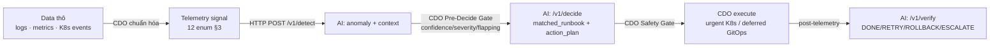

# 06 Runbook Library — Data → Detect → Decide → Heal (CDO-02 ↔ AI Engine)

**Doc owner:** CDO-02
**Phạm vi:** Bàn giao cho **team AI** — catalog runbook mà `/v1/decide` phải trả về cho từng loại lỗi phát hiện qua data (logs/metrics/events).
**Bám:** `contract - new 4/{telemetry,ai-api,deployment}-contract.md`, `executor/` (reference implementation).
**Cập nhật:** 2026-06-30

---

## 1. Mục đích

Tài liệu này trả lời 1 câu hỏi cho team AI:

> "Khi data (logs/metrics/events) cho thấy một lỗi, `/v1/decide` phải trả `matched_runbook` + `action_plan` nào để CDO tự chữa lành an toàn?"

CDO **không** tự chọn fix theo fault type — AI Engine là bộ não match pattern, CDO là bàn tay thực thi sau khi qua safety gate. Vì vậy AI cần biết **chính xác** catalog runbook + action enum + pattern_type + params + ngưỡng an toàn mà CDO chấp nhận. Trả sai runbook/action → CDO deny ở safety gate (không execute).

Runbook ở đây = **reference implementation** trong `executor/mock_ai_server.py` (mock đang dùng để đạt auto-resolve 71.4% trên 14 scenario). AI team build engine thật phải trả schema tương đương.

---

## 2. Luồng tổng thể: từ data đến hành động



AI chịu trách nhiệm 3 hộp: **detect → decide → verify**. CDO chịu detection-layer (data→signal), 2 gate, execute, audit.

---

## 3. Detection Layer — từ data thô về telemetry signal enum

AI **chỉ** nhận telemetry đã chuẩn hóa theo 12 `signal_name` enum (telemetry-contract §3). CDO ánh xạ data thô → signal trước khi gọi `/v1/detect`. Mọi `signal_name` ngoài enum → AI reject `400`.

### 3.1 Nguồn data → signal (CDO làm, AI tham chiếu)

| Data thô (nguồn) | Signal enum phát đi | Kiểu `value` |
|---|---|---|
| K8s `waiting.reason = OOMKilled` / `terminated.exitCode = 137` | `pod_oom_event` | string mô tả |
| K8s `waiting.reason = CrashLoopBackOff` / `Error`; `restartCount > 3` | `container_restart_count` | int (số lần restart) |
| K8s `waiting.reason = ImagePullBackOff` / `ErrImagePull`; probe fail | `service_unhealthy` | string mô tả |
| Prometheus working-set bytes | `container_resource_usage` | int (bytes) |
| Prometheus p95 histogram | `service_latency_p95` | number (ms) |
| Error/request counters (cửa sổ trượt) | `service_error_rate` | number 0.0–1.0 |
| Queue depth (SQS/RabbitMQ) | `queue_backlog` | int |
| Secrets/Cert Manager event | `secret_expiry_warning` | int (ngày còn lại) |
| Log ERROR/stack trace (đã scrub PII) | `application_log_event` | string |
| OTel trace span lỗi | `distributed_trace_error_event` | int (status code) |
| RPS counter | `service_throughput_rps` | number |
| DB pool monitor | `db_connection_pool_saturation` | number 0.0–1.0 |

> `labels.system = "K8S_NATIVE"` (bắt buộc), kèm `namespace`, `deployment`, `pod_name`, `container` khi có. Tham chiếu: `executor/watcher.py` (`_WAITING_REASON_MAP`, `_signal()`).

### 3.2 Nguồn real-time qua Prometheus Alert (telemetry-contract §2.5.C)

Pipeline chính: PrometheusRule fire → Alertmanager → **Alert Forwarder** (`forwarder/alert_map.py`) → telemetry signal → SQS → Executor. alertname ánh xạ trực tiếp signal:

| PrometheusRule alertname | signal_name | Runbook |
|---|---|---|
| `PodOOMKilled` | `pod_oom_event` | R1 OOMPatchMemory |
| `HighContainerMemory` | `container_resource_usage` | R1 OOMPatchMemory |
| `ContainerCrashLooping` | `container_restart_count` | R2/R3 |
| `ImagePullBackOff` | `service_unhealthy` | R3 BadDeployRollback |
| `HighLatencyP95` | `service_latency_p95` | R2 ServiceStuckRestart |
| `HighErrorRate` | `service_error_rate` | R2 ServiceStuckRestart |

Định nghĩa rule: `manifests/monitoring/prometheus-rules.yaml`. Watcher poll K8s 30s (`watcher.py`) là **fallback** khi SQS rỗng/lỗi.

---

## 4. Runbook Catalog (master table)

Đây là bảng AI phải match. Cột "trigger signal" là tín hiệu chính; AI dùng thêm severity/confidence để quyết định.

| # | Runbook | Trigger signal (chính) | `pattern_type` | `action` | `params` bắt buộc | Trạng thái |
|---|---|---|---|---|---|---|
| R1 | `OOMPatchMemoryRunbook` | `pod_oom_event`, `container_resource_usage` | `urgent` | `PATCH_MEMORY_LIMIT` | `namespace`, `container`, `memory_limit_mb` (≤4096) | ✅ build-real |
| R2 | `ServiceStuckRestartRunbook` | `service_unhealthy`, `service_latency_p95`, `service_error_rate`, `container_restart_count` | `urgent` | `RESTART_DEPLOYMENT` | `namespace` | ✅ build-real |
| R3 | `BadDeployRollbackRunbook` | `service_unhealthy` (ImagePullBackOff/bad deploy), `container_restart_count` cao sau deploy | `urgent` | `ROLLOUT_UNDO` | `namespace` | ✅ build-real |
| R4 | `CapacityScaleRunbook` | `queue_backlog`, `service_throughput_rps` | `deferred` | `SCALE_REPLICAS` | `namespace`, `replicas` (1–10) | ✅ build-real (synthetic inject) |
| R5 | `SecretRotationRunbook` | `secret_expiry_warning` | `deferred` | `ROTATE_SECRET` | `namespace`, `secret_name` (allow-list) | 🟡 designed-only |

> **Action enum cố định** (ai-api §3.2): `RESTART_DEPLOYMENT`, `PATCH_MEMORY_LIMIT`, `SCALE_REPLICAS`, `ROLLOUT_UNDO`, `ROTATE_SECRET`. Mọi action khác (vd `DELETE_NAMESPACE`, `DELETE_POD`) → CDO deny `denied_action_not_allowed`.
> **Routing**: urgent action ∈ {RESTART_DEPLOYMENT, PATCH_MEMORY_LIMIT, ROLLOUT_UNDO}; deferred action ∈ {SCALE_REPLICAS, ROTATE_SECRET}. Trả urgent action với `pattern_type:"deferred"` (hoặc ngược lại) → CDO deny `invalid_pattern_type`.

---

## 5. Chi tiết từng Runbook

Mỗi runbook ghi: **trigger** (data nào), **AI làm gì**, **action_plan**, **verify**, **rollback/escalate**.

### R1 — OOMPatchMemoryRunbook (OOM / memory pressure)
- **Trigger data**: pod bị `OOMKilled` (`pod_oom_event`, exitCode 137) hoặc working-set bytes tiệm cận limit (`container_resource_usage`).
- **AI quyết định**: `pattern_type:"urgent"`, action `PATCH_MEMORY_LIMIT`, tăng `memory_limit_mb` (≤ **4096** = cap blast-radius + Kyverno). Thêm `container` (bắt buộc cho action này).
- **Verify**: `verify_policy.window_seconds≈120`, `success_conditions: ["pod_ready == true", "restart_count_no_increase == true", "container_memory_usage_pct < 80"]`.
- **Rollback**: nếu sau patch vẫn OOM (regression) → AI verify trả `ROLLBACK`; CDO restore `memory_limit` từ snapshot đã capture trước execute.
- Scenario tham chiếu: `sc01`, `sc05`, `sc06` (→ auto_resolved), `sc09` (OOM persist → `ROLLBACK`).

### R2 — ServiceStuckRestartRunbook (treo / latency / lỗi tạm thời)
- **Trigger data**: probe fail (`service_unhealthy`), p95 vọt (`service_latency_p95`), error-rate tăng (`service_error_rate`), hoặc crashloop nhẹ (`container_restart_count`).
- **AI quyết định**: `urgent`, `RESTART_DEPLOYMENT`, chỉ cần `params.namespace`.
- **Verify**: window ~120s, `pod_ready == true` + error_rate/p95 trở lại baseline.
- **Escalate**: nếu sau restart metrics vẫn xấu → verify trả `ESCALATE` kèm `escalation_bundle` (xem §9). Scenario `sc14`.
- Scenario tham chiếu: `sc02`, `sc03`, `sc07`, `sc08`.

### R3 — BadDeployRollbackRunbook (deploy lỗi)
- **Trigger data**: revision mới gây `ImagePullBackOff`/`ErrImagePull` (`service_unhealthy`) hoặc `container_restart_count` tăng vọt ngay sau rollout.
- **AI quyết định**: `urgent`, `ROLLOUT_UNDO`, `params.namespace`.
- **Verify**: pod của revision trước Ready, restart_count ngừng tăng.
- Scenario tham chiếu: `sc04`.

### R4 — CapacityScaleRunbook (nghẽn hàng đợi / quá tải)
- **Trigger data**: `queue_backlog` cao (vd 15000), hoặc `service_throughput_rps` vượt capacity.
- **AI quyết định**: `pattern_type:"deferred"` (KHÔNG mutate trực tiếp K8s), `SCALE_REPLICAS`, `params.replicas` trong **1–10**. CDO tạo Git commit → ArgoCD sync.
- **Verify**: sau sync, `queue_backlog` giảm; replicas Ready.
- Scenario tham chiếu: `sc10`.

### R5 — SecretRotationRunbook (🟡 designed-only)
- **Trigger data**: `secret_expiry_warning` (số ngày còn lại ≤ ngưỡng).
- **AI quyết định**: `pattern_type:"deferred"`, `ROTATE_SECRET`, `params.secret_name` phải nằm trong allow-list. CDO path GitOps.
- **Trạng thái**: thiết kế-trên-giấy (paper playbook + diagram), CHƯA build auto Git ops cho W12 — xem [w12-scope]. AI có thể trả runbook này; CDO sẽ deny an toàn nếu secret ngoài allow-list.

---

## 6. Pre-Decide Gate — AI phải set confidence/severity đúng

CDO chạy gate này **sau `/v1/detect`, trước `/v1/decide`**. Nếu AI trả confidence/severity không hợp lý, CDO sẽ không gọi decide. AI cần calibrate theo bảng (giá trị từ `executor/config.py`):

| `confidence` | `severity` | CDO làm gì | audit reason |
|---|---|---|---|
| `anomaly_detected=false` | — | đóng, no action | `no_anomaly` |
| `< 0.5` | bất kỳ | discard (coi là nhiễu) | `low_confidence_discard` |
| `0.5–0.79` | LOW/MEDIUM | log warning, no action | `low_confidence_no_action` |
| `0.5–0.79` | HIGH/CRITICAL | escalate ngay | `low_confidence_escalated` |
| `>= 0.8` | MEDIUM+ | → gọi `/v1/decide` | `proceed_to_decide` |
| (flapping) | — | service detect lần 3+ trong 600s → escalate | `flapping_escalated` |

> Ngưỡng: `GATE_CONF_DISCARD=0.5`, `GATE_CONF_EXECUTE=0.8`, `flap_threshold=3`, `flap_window=600s`. Scenario `sc13` (conf 0.55 + severity thấp → `low_confidence_no_action`).

---

## 7. Guardrails an toàn AI phải tôn trọng (CDO Safety Gate)

`/v1/decide` response phải lọt **6 check** của safety gate (`executor/safety_gate.py`), nếu không CDO deny + escalate, không execute:

| Check | AI phải đảm bảo | Deny reason nếu sai |
|---|---|---|
| pattern_type hợp lệ | `"urgent"` hoặc `"deferred"` | `invalid_pattern_type` |
| verify_policy có mặt | `verify_policy.window_seconds > 0` | `missing_verify_policy` |
| action allow-list | action ∈ 5 enum | `denied_action_not_allowed` |
| pattern routing | urgent/deferred action đúng nhóm (§4) | `invalid_pattern_type` |
| tenant match | mọi `params.namespace` = namespace của incident **và** ∈ `blast_radius_config.allowed_namespaces` | `denied_cross_tenant` |
| blast radius | `SCALE_REPLICAS`: 1 ≤ replicas ≤ **10**; `PATCH_MEMORY_LIMIT`: `memory_limit_mb` ≤ **4096**; `max_pod_impact_pct` ≤ 100 | `blast_radius_exceeded` / `scale_to_zero_denied` |

**`blast_radius_config` khuyến nghị** (mock đang dùng): `max_pod_impact_pct: 25`, `circuit_breaker_error_rate: 0.20`, `allowed_namespaces: [<namespace của incident>]`.

> Scenario chứng minh: `sc11` (AI target `tenant-b` cho incident `tenant-a` → `denied_cross_tenant`), `sc12` (`DELETE_NAMESPACE` → `denied_action_not_allowed`). CDO coi đây là **pass** (fail-safe), không phải auto_resolved.

---

## 8. `/v1/verify` → `next_action` (AI điều khiển bước cuối)

Sau khi CDO execute + thu post-telemetry, AI trả 1 trong 4:

| `next_action` | Khi nào | CDO làm |
|---|---|---|
| `DONE` | metrics hồi phục | đóng incident → `auto_resolved` |
| `RETRY` | chưa ổn nhưng đáng thử lại | retry cùng pattern |
| `ROLLBACK` | regression (xấu hơn sau action) | restore snapshot CDO đã capture → `rolled_back` |
| `ESCALATE` | AI bó tay | gửi `escalation_bundle` lên trực ban |

`regression_detected: true` báo tác dụng phụ. `ROLLBACK` áp dụng cho cả urgent (kubectl/patch ngược) lẫn deferred (revert commit → ArgoCD).

---

## 9. Escalation bundle (khi `next_action=ESCALATE`)

AI trả `escalation_bundle` shape `{reason, logs, metrics}`; CDO merge thêm context local rồi gửi (webhook hoặc mock pager). Ví dụ (từ `sc14`):

```json
{
  "success": false,
  "regression_detected": false,
  "next_action": "ESCALATE",
  "escalation_bundle": {
    "reason": "Sau RESTART, error_rate vẫn vượt ngưỡng — AI không tự xử được.",
    "logs": ["app: connection pool exhausted", "app: 503 upstream"],
    "metrics": { "error_rate": 0.42, "p95_latency_ms": 3100 }
  }
}
```

---

## 10. Ví dụ end-to-end — R1 (OOM)

**Data thô**: pod `cdo-sample-api-xxx` OOMKilled (exitCode 137) ở `tenant-a`.

**CDO → `/v1/detect`** (telemetry đã chuẩn hóa):
```json
{ "ts": "2026-06-30T10:00:00.123Z", "tenant_id": "6c8b4b2b-4d45-4209-a1b4-4b532d56a31c",
  "service": "checkout-svc", "signal_name": "pod_oom_event",
  "value": "OOMKilled: Pod cdo-sample-api-xxx, Container main, Exit Code 137",
  "labels": { "system": "K8S_NATIVE", "namespace": "tenant-a", "deployment": "cdo-sample-api" } }
```

**AI → DetectResponse**: `anomaly_detected:true`, `severity:0.85`, `confidence:0.92`, `anomaly_context{target_service, suspected_fault_type:"oom", system, namespace:"tenant-a", deployment:"cdo-sample-api"}`.

**AI → DecideResponse** (đúng catalog R1):
```json
{ "matched_runbook": "OOMPatchMemoryRunbook", "pattern_type": "urgent",
  "action_plan": [{ "step": 1, "action": "PATCH_MEMORY_LIMIT",
    "target": "deployment/cdo-sample-api",
    "params": { "namespace": "tenant-a", "container": "main", "memory_limit_mb": 1024 } }],
  "blast_radius_config": { "max_pod_impact_pct": 25, "circuit_breaker_error_rate": 0.20,
    "allowed_namespaces": ["tenant-a"] },
  "verify_policy": { "window_seconds": 120, "success_conditions": ["pod_ready == true"] },
  "correlation_id": "...", "idempotency_key": "...", "dry_run_mode": false, "cost_cap_exceeded": false }
```

**CDO**: safety gate pass → capture snapshot → dry-run → patch → `/v1/verify` → `DONE` → `auto_resolved`.

---

## Tài liệu liên quan
- `contract - new 4/telemetry-contract.md` §3–4 (signal enum + đặc tả)
- `contract - new 4/ai-api-contract.md` §3 (schema detect/decide/verify)
- `02_infra_design.md` §5 (luồng), §8 (safety gate)
- `executor/mock_ai_server.py` (reference catalog), `executor/watcher.py` (detection mapping), `executor/scenarios/sc*.json` (14 scenario)
