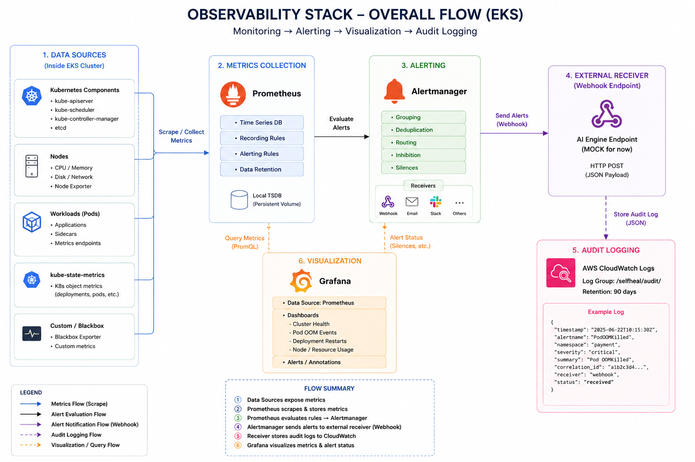

# M6 – IaC: Observability Stack Flow (EKS)

File M6-IaC_Observability_v1.0.md là bản draft. Đây là tài liệu sơ bộ, một số nội dung có thể thay đổi khi có thêm thông tin từ dự án. Hiện tại tài liệu chỉ phản ánh đề xuất ban đầu.
<br>Time: 23/06/26
<br><br>
<br>

## 1. Mục tiêu

Triển khai một Observability Stack trên Amazon EKS nhằm:

* Giám sát tình trạng cluster và workloads.
* Phát hiện các sự kiện bất thường (Pod OOM, Deployment Restart, Resource Exhaustion,...).
* Gửi alert tới Webhook Endpoint.
* Lưu audit log làm evidence cho E2E test.
* Chuẩn bị sẵn integration với AI Engine của TF3.

---

## 2. Thành phần kiến trúc

## Amazon EKS Cluster

Chứa toàn bộ workloads:

* Application Pods
* Kubernetes Components
* Monitoring Stack

Monitoring stack được deploy bằng:

```text
kube-prometheus-stack (Helm)
```

---

## Prometheus

Vai trò:

* Thu thập metrics từ cluster.
* Lưu metrics dạng time-series.
* Đánh giá Alert Rules.

Nguồn metrics:

### Kubernetes Components

* kube-apiserver
* kube-controller-manager
* kube-scheduler
* etcd

### Nodes

* CPU
* Memory
* Disk
* Network

Thông qua:

```text
node-exporter
```

### Workloads

* Pod status
* Container restart count
* Resource consumption

Thông qua:

```text
kube-state-metrics
```

---

## Alertmanager

Vai trò:

* Nhận alert từ Prometheus
* Group alert
* Deduplicate alert
* Route alert tới receiver

Ví dụ:

```text
PodOOMKilled
DeploymentRestartLoop
HighMemoryUsage
```

Sau khi xử lý:

```text
HTTP POST
→ Webhook Receiver
```

---

## Webhook Receiver (Mock AI Endpoint)

Mục tiêu:

Nhận alert từ Alertmanager.

Trong W11:

```text
Mock Service
```

Ví dụ:

```text
POST /alerts
```

Chức năng:

1. Nhận payload JSON
2. Ghi log
3. Trả HTTP 200

Ví dụ:

```json
{
  "status": "firing",
  "alertname": "PodOOMKilled",
  "namespace": "payment",
  "pod": "payment-api"
}
```

---

## CloudWatch Logs

Log Group:

```text
/selfheal/audit/
```

Retention:

```text
90 days
```

Vai trò:

### Không phải hệ thống metrics chính

Metrics được quản lý bởi:

```text
Prometheus
+
Grafana
```

CloudWatch trong M6 chỉ dùng để:

### Audit Log

Ví dụ:

```json
{
  "timestamp": "2026-06-23T10:30:00Z",
  "alert": "PodOOMKilled",
  "namespace": "payment",
  "status": "received"
}
```

### Evidence

Chứng minh:

```text
Alert được tạo
→ Webhook nhận được
→ Log được lưu
```

### Chuẩn bị cho Self-Heal Engine

Sau này có thể lưu:

* correlation_id
* decision
* action
* verify_result
* rollback_result

---

## Grafana

Vai trò:

Visualization layer.

Dashboard cơ bản:

### Cluster Health

* Node CPU
* Node Memory
* Pod Count
* Node Status

### Pod OOM Events

* OOM Count
* OOM Trend
* OOM by Namespace

### Deployment Restarts

* Restart Count
* Restart Trend
* Restart by Workload

Grafana lấy dữ liệu từ:

```text
Prometheus
```

CloudWatch không phải datasource chính của Grafana trong M6.

---

# 3. Luồng Metrics

```text
Pods / Nodes
        ↓
node-exporter
kube-state-metrics
        ↓
Prometheus
        ↓
Grafana Dashboard
```

---

# 4. Luồng Alert

```text
Pods / Nodes
        ↓
Prometheus
        ↓
Alert Rule Firing
        ↓
Alertmanager
        ↓
HTTP POST
        ↓
Webhook Receiver
```

---

# 5. Luồng Audit

```text
Webhook Receiver
        ↓
Write Log
        ↓
CloudWatch Logs
        ↓
Retention 90 days
```

---

# 6. E2E Test Flow

## Step 1

Trigger fake incident:

Ví dụ:

```bash
kubectl run oom-test \
--image=polinux/stress \
--restart=Never \
--vm 1 \
--vm-bytes 512M \
--vm-hang 10
```

---

## Step 2

Prometheus phát hiện:

```text
PodOOMKilled
```

---

## Step 3

Alert Rule chuyển trạng thái:

```text
Pending
→
Firing
```

---

## Step 4

Alertmanager gửi:

```text
POST /alerts
```

---

## Step 5

Webhook Receiver nhận payload.

Ví dụ:

```json
{
  "status": "firing",
  "alertname": "PodOOMKilled"
}
```

---

## Step 6

Receiver ghi log:

```text
/selfheal/audit/
```

trên CloudWatch.

---

## Step 7

Chụp evidence:

1. Prometheus Alert Firing
2. Alertmanager Config
3. Webhook Receiver Log
4. CloudWatch Log Group
5. Grafana Dashboard

---

# 7. Kiến trúc tổng quan

```text
Pods / Nodes
      ↓
Exporters
(node-exporter, kube-state-metrics)
      ↓
Prometheus
      ↓
Alert Rules
      ↓
Alertmanager
      ↓
Webhook Receiver (Mock)
      ↓
CloudWatch Logs
      ↓
Evidence & Audit Trail

Prometheus
      ↓
Grafana
      ↓
Dashboards
```

---

# 8. Future Integration (TF3)

Sau khi AI Contract được freeze:

```text
Alertmanager
      ↓
AI Engine Endpoint
      ↓
Detect
      ↓
Decide
      ↓
Verify
      ↓
Audit Log
```

Observability Stack không cần thay đổi kiến trúc.

Chỉ cần thay:

```text
Webhook Receiver URL
```

từ:

```text
/mock/alerts
```

sang:

```text
/v1/detect
```

hoặc endpoint do AI Team cung cấp.
