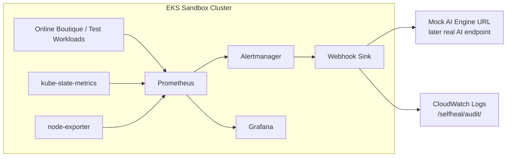

# Prometheus - Báo Cáo PoC Cho Self-Heal Engine

## 1. Tóm Tắt

Trong PoC Self-Heal Engine, Prometheus là thành phần thu thập và chuẩn hóa metrics từ EKS sandbox cluster. Metrics từ Prometheus được dùng cho 3 mục tiêu chính:

- Phát hiện tình trạng bất thường của workload Kubernetes.
- Cung cấp dữ liệu cho Alertmanager để trigger alert sang webhook sink.
- Làm nguồn dữ liệu cho Grafana dashboards và bước verify sau self-heal action.

Prometheus không tự thực hiện hành động chữa lỗi. Vai trò của Prometheus là quan sát, lưu metrics ngắn hạn, đánh giá alert rules và cung cấp tín hiệu đáng tin cậy cho pipeline:

```text
EKS Workloads -> Prometheus -> Alertmanager -> Webhook Sink -> Mock/AI Engine
        |              |
        |              v
        |           Grafana
        v
 Kubernetes Metrics / Events
```

## 2. Phạm Vi PoC

Phạm vi Prometheus trong PoC M6:

- Deploy Prometheus thông qua Helm chart `kube-prometheus-stack`.
- Chạy trong EKS sandbox cluster, dự kiến namespace `monitoring`.
- Scrape metrics từ Kubernetes, node, pod, deployment và kube-state-metrics.
- Tạo alert rule giả lập để test E2E.
- Kết nối Alertmanager để gửi alert tới webhook sink.
- Cung cấp datasource cho Grafana dashboards.

Ngoài phạm vi PoC:

- Multi-region Prometheus HA.
- Long-term metrics retention bằng Thanos/Cortex/Mimir.
- Production SLO đầy đủ cho toàn bộ hệ thống.
- Real PagerDuty/OpsGenie integration.
- Prometheus tự gọi trực tiếp AI Engine để execute action.

## 3. Lý Do Chọn Prometheus

Prometheus phù hợp với PoC này vì:

- Là chuẩn phổ biến cho Kubernetes/EKS observability.
- Tích hợp tốt với `kube-state-metrics`, node exporter, Alertmanager và Grafana.
- Hỗ trợ PromQL để viết alert rule cho các known patterns như pod restart, OOMKilled, deployment unhealthy.
- Có thể deploy nhanh bằng `kube-prometheus-stack`, giảm rủi ro cấu hình thủ công.
- Dễ tạo fake alert deterministic để làm evidence E2E cho khách hàng.

Các lựa chọn khác đã cân nhắc:

| Lựa chọn | Ưu điểm | Nhược điểm | Quyết định |
|---|---|---|---|
| Prometheus + Alertmanager | Kubernetes-native, mạnh về metrics/alerts, dễ demo | Cần quản lý rule/query | Chọn cho PoC |
| CloudWatch Container Insights only | AWS-managed, ít vận hành | Alert flow sang AI/webhook kém linh hoạt hơn | Không chọn làm core |
| Datadog/New Relic | Nhanh, UI mạnh | Phụ thuộc SaaS, cost và credential ngoài scope | Không chọn cho PoC |
| Custom metrics collector | Kiểm soát cao | Tốn thời gian, rủi ro cao | Không chọn |

## 4. Kiến Trúc Đề Xuất



Component responsibilities:

| Component | Responsibility |
|---|---|
| Prometheus | Scrape and store metrics, evaluate alert rules |
| kube-state-metrics | Export Kubernetes object state, including pods/deployments |
| node-exporter | Export node CPU, memory, filesystem, network metrics |
| Alertmanager | Route firing alerts to webhook sink |
| Grafana | Visualize Prometheus metrics for PoC evidence |
| Webhook Sink | Receive Alertmanager payload, forward to mock AI URL, write audit log |

## 5. Prometheus Deployment Plan

Prometheus will be installed as part of `kube-prometheus-stack`.

Suggested repository structure:

```text
infra/
  observability/
    values-kube-prometheus-stack.yaml
    prometheus-rules/
      selfheal-test-alert.yaml
    grafana-dashboards/
      cluster-health.json
      pod-oom-events.json
      deployment-restarts.json
```

Deployment steps:

1. Create namespace `monitoring`.
2. Add Helm repo for Prometheus community charts.
3. Install or upgrade `kube-prometheus-stack` with project values file.
4. Verify Prometheus, Alertmanager, Grafana, kube-state-metrics and node-exporter pods are Ready.
5. Apply PrometheusRule for fake alert and self-heal-related alert candidates.
6. Configure Alertmanager receiver to call webhook sink.
